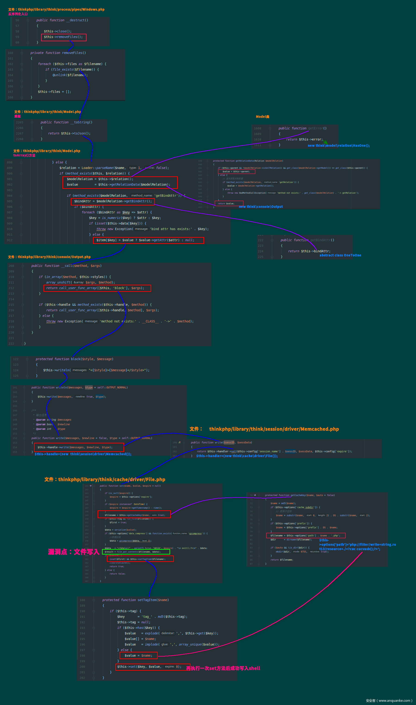

# **TP 5.0.x  反序列化链**
## **利用分析**
### **入口点和终点**
入口点为thinkphp/library/think/process/pipes/Windows.php中的__destruct(),该析构函数执行removeFiles()方法
```php
//thinkphp/library/think/process/pipes/Windows.php
    public function __destruct()
    {
        $this->close();
        $this->removeFiles();//入口
    }
```
而在removeFiles()方法中会使用file_exists($filename)对文件进行判断,如果\$filename为一个对象的话就会触发该对象的__tostring方法
```php
    private function removeFiles()
    {
        foreach ($this->files as $filename) {
            if (file_exists($filename)) {//触发__tostring()
                @unlink($filename);
            }
        }
        $this->files = [];
    }
```
一般终点会选择__call方法,因为__call方法会在调用对象不存在的方法时触发,一般会使用call_user_func()来动态执行函数,如果call_user_func()可控便可以RCE
终点选择thinkphp/library/think/console/Output.php的__call方法
```php
    public function __call($method, $args)
    {
        if (in_array($method, $this->styles)) {
            array_unshift($args, $method);
            return call_user_func_array([$this, 'block'], $args);//POP链终点
        }

        if ($this->handle && method_exists($this->handle, $method)) {
            return call_user_func_array([$this->handle, $method], $args);
        } else {
            throw new Exception('method not exists:' . __CLASS__ . '->' . $method);
        }
    }

}
```
### **POP链**
从入口到终点的利用链构造,首先先寻找一个可利用类的的__tostring(),第一个跳板可以选择thinkphp/library/think/Model.php的__tostring方法,该方法会调用toJson()方法,因为Model类为抽象类,不能被实例化,所以exp需要使用其子类
```php
    public function __toString()
    {
        return $this->toJson();
    }
```
来到toJson()方法,该方法中会调用toArray()方法
```php
    public function toJson($options = JSON_UNESCAPED_UNICODE)
    {
        return json_encode($this->toArray(), $options);
    }
```
在toArray()方法中,我们需要找到一个点使得类可控,但其调用的方法在Output.php类中不存在,其中可以触发__call方法的地方一共三处,第一二处的触发的__call方法后不能继续利用,所以选择`$item[$key] = $value ? $value->getAttr($attr) : null;//第三处`来触发
```php
        if (!empty($this->append)) {
            foreach ($this->append as $key => $name) {
                if (is_array($name)) {
                    // 追加关联对象属性
                    $relation   = $this->getAttr($key);
                    $item[$key] = $relation->append($name)->toArray();
                } elseif (strpos($name, '.')) {
                    list($key, $attr) = explode('.', $name);
                    // 追加关联对象属性
                    $relation   = $this->getAttr($key);
                    $item[$key] = $relation->append([$attr])->toArray();//第一处
                } else {
                    $relation = Loader::parseName($name, 1, false);
                    if (method_exists($this, $relation)) {
                        $modelRelation = $this->$relation();
                        $value         = $this->getRelationData($modelRelation);

                        if (method_exists($modelRelation, 'getBindAttr')) {
                            $bindAttr = $modelRelation->getBindAttr();//第二处
                            if ($bindAttr) {
                                foreach ($bindAttr as $key => $attr) {
                                    $key = is_numeric($key) ? $attr : $key;
                                    if (isset($this->data[$key])) {
                                        throw new Exception('bind attr has exists:' . $key);
                                    } else {
                                        $item[$key] = $value ? $value->getAttr($attr) : null;//第三处
                                    }
                                }
                                continue;
                            }
                        }
                        $item[$name] = $value;
                    } else {
                        $item[$name] = $this->getAttr($name);
                    }
                }
            }
        }
        return !empty($item) ? $item : [];
    }
```
可以看到$value的值来自与\$this->getRelationData(\$modelRelation);,而\$modelRelation的值可以选择一个可控的返回值即可,可以选择getError(),该方法直接返回\$this->error值,比较简单
```php
        if (method_exists($this, $relation)) {
            $modelRelation = $this->$relation();
            $value         = $this->getRelationData($modelRelation);//赋值
        ...
        }
        public function getError()
        {
        return $this->error;
        }
                
```
来到getRelationData()中,想要得到可控的\$value值,需要满足`if ($this->parent && !$modelRelation->isSelfRelation() && get_class($modelRelation->getModel()) == get_class($this->parent))`
```php
    protected function getRelationData(Relation $modelRelation)
    {
        if ($this->parent && !$modelRelation->isSelfRelation() && get_class($modelRelation->getModel()) == get_class($this->parent)) {
            $value = $this->parent;
        } else {
            // 首先获取关联数据
            if (method_exists($modelRelation, 'getRelation')) {
                $value = $modelRelation->getRelation();
            } else {
                throw new BadMethodCallException('method not exists:' . get_class($modelRelation) . '-> getRelation');
            }
        }
        return $value;
    }
```
其中isSelfRelation()和getModel()的返回值可是可控的,相关函数如下,而要满足`get_class($modelRelation->getModel()) == get_class($this->parent))`,只要\$modelRelation为modle\Relation的子类即可,可以选择\relation\HasOne()类
```php
    public function isSelfRelation()
    {
        return $this->selfRelation;//可控
    }
    public function getModel()
    {
        return $this->query->getModel();//可控
    }
    public function getModel()
    {
        return $this->model;//可控
    }
```
而传入的参数$sttr来源于\$modelRelation->getBindAttr()的返回值  ,这里的\$modelRelation即为getError的返回值,也就是HasOne()类
```php
        if (method_exists($modelRelation, 'getBindAttr')) {
            $bindAttr = $modelRelation->getBindAttr();
                if ($bindAttr) {
                    foreach ($bindAttr as $key => $attr) {
                        $key = is_numeric($key) ? $attr : $key;
                                if (isset($this->data[$key])) {
                                    throw new Exception('bind attr has exists:' . $key);
                                } else {
                                    $item[$key] = $value ? $value->getAttr($attr) : null;
                                }
```
来到HasOne()的的getBindAttr()方法,该方法在父类OneToOne中实现,可控
```php
//thinkphp/library/think/model/relation/OneToOne.php
    public function getBindAttr()
    {
        return $this->bindAttr;
    }
```
至此已经可以触发__call方法了,再来看Output类的__call方法,在call_user_func_array中其调用了该类block的方法
```php
        if (in_array($method, $this->styles)) {
            array_unshift($args, $method);
            return call_user_func_array([$this, 'block'], $args);
        }
```
而在block方法中,首先调用了writeln()->write()->$this->handle->write(),而\$this->handle是可控的,那么只要找到一个类的wirte方法进行利用即可
```php
    protected function block($style, $message)
    {
        $this->writeln("<{$style}>{$message}</$style>");
    }

    public function writeln($messages, $type = self::OUTPUT_NORMAL)
    {
        $this->write($messages, true, $type);
    }
    public function write($messages, $newline = false, $type = self::OUTPUT_NORMAL)
    {
        $this->handle->write($messages, $newline, $type);
    }        
```
这里可以选择handle对象为thinkphp/library/think/session/driver/Memcached.php的Memcached类,在其write方法中调用了set()方法,而this->handler是可控的,所以再次搜索可利用的set方法
```php
    public function write($sessID, $sessData)
    {
        return $this->handler->set($this->config['session_name'] . $sessID, $sessData, 0, $this->config['expire']);
    }

```
可以看到thinkphp/library/think/cache/driver/File.php的set方法中可以进行文件写入,但在之前需要绕过前面的exit(),这里可以通过文件名可控利用伪协议来编码前面的exit()从而绕过,但$datad的值来源于\$value,而$value的值来自与之前write方法中的值为固定的true,不可控
```php
    public function set($name, $value, $expire = null)
    {
        if (is_null($expire)) {
            $expire = $this->options['expire'];
        }
        if ($expire instanceof \DateTime) {
            $expire = $expire->getTimestamp() - time();
        }
        $filename = $this->getCacheKey($name, true);
        if ($this->tag && !is_file($filename)) {
            $first = true;
        }
        $data = serialize($value);
        if ($this->options['data_compress'] && function_exists('gzcompress')) {
            //数据压缩
            $data = gzcompress($data, 3);
        }
        $data   = "<?php\n//" . sprintf('%012d', $expire) . "\n exit();?>\n" . $data;//需要绕过exit()
        $result = file_put_contents($filename, $data);//文件写入getshell
        if ($result) {
            isset($first) && $this->setTagItem($filename);//会再次调用set
            clearstatcache();
            return true;
        } else {
            return false;
        }
    }
```
但在下面的setTagItem()方法中发现其再次调用了set方法,而这次的$value来自于传入的文件名,所以可以在文件名中加入shell,结合之前利用伪协议的原因,文件名可以为`php://filter/write=string.rot13/resource=./<?cuc cucvasb();?>`
```php
    protected function setTagItem($name)
    {
        if ($this->tag) {
            $key       = 'tag_' . md5($this->tag);
            $this->tag = null;
            if ($this->has($key)) {
                $value   = explode(',', $this->get($key));
                $value[] = $name;
                $value   = implode(',', array_unique($value));
            } else {
                $value = $name;//来源与$name值,即文件名
            }
            $this->set($key, $value, 0);//再次调用set
        }
    }
```


### 最后
**鸡肋,且仅windows可用**