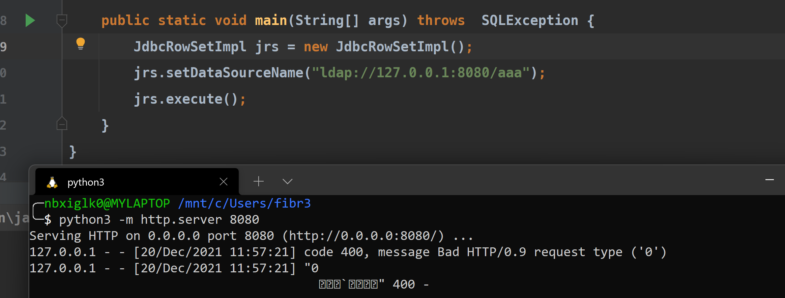

# JdbcRowSetImpl利用链
- [JdbcRowSetImpl利用链](#jdbcrowsetimpl利用链)
  - [JdbcRowSet概述](#jdbcrowset概述)
  - [connect()](#connect)
    - [dataSource](#datasource)
    - [prepare()](#prepare)
    - [getDatabaseMetaData()](#getdatabasemetadata)
    - [setAutoCommit()](#setautocommit)
      - [在FastJson中的利用](#在fastjson中的利用)
  - [利用条件](#利用条件)
## JdbcRowSet概述
JdbcRowSetImpl类是JdbcRowSet接口的实现类,而JdbcRowSet接口是一个针对ResultSet对象的封装器,而ResultSet对象即查询结果集,即数据库查询后包含了查询结果的一个对象,JdbcRowSet接口的作用则是实现可以将结果集对象当作JavaBean对象来使用,同时jdbcRowSet对象会持续的和数据库保持连接.
## connect()
JdbcRowSetImpl类中有一个`connect()`方法如下.

其中调用了`javax.naming.InitialContext.lookup`方法,也就是JNDI查询,而参数为`getDataSourceName()`返回,即该类的`dataSource`属性值,那么如果该属性可控的话则会造成JDNI注入.
而引用了`connect()`方法的地方一共有三处,分别是
* JdbcRowSetImpl.prepare()
* JdbcRowSetImpl.getDatabaseMetaData()
* JdbcRowSetImpl.setAutoCommit()
### dataSource
设置`dataSource`属性的地方`setDataSourceName`,其中会覆盖之前的`dataSource`.
```java
    public void setDataSourceName(String var1) throws SQLException {
        if (this.getDataSourceName() != null) {
            if (!this.getDataSourceName().equals(var1)) {
                super.setDataSourceName(var1);
                this.conn = null;
                this.ps = null;
                this.rs = null;
            }
        } else {
            super.setDataSourceName(var1);
        }
    }
```
父类`BaseRowSet.java#setDataSourceName`.
```java

    public void setDataSourceName(String name) throws SQLException {

        if (name == null) {
            dataSource = null;
        } else if (name.equals("")) {
           throw new SQLException("DataSource name cannot be empty string");
        } else {
           dataSource = name;
        }

        URL = null;
    }
```
### prepare()
该方法引用`connect()`的地方如下
```java
protected PreparedStatement prepare() throws SQLException {
        this.conn = this.connect();
        try {
            ...
            ...
            ...
```
而引用了`prepare()`的地方如下:
* JdbcRowSetImpl.execute()
```java
    public void execute() throws SQLException {
        this.prepare();
        this.setProperties(this.ps);
        this.decodeParams(this.getParams(), this.ps);
        this.rs = this.ps.executeQuery();
        this.notifyRowSetChanged();
    }
```

* JdbcRowSetImpl.getMetaData()
```java
    public ResultSetMetaData getMetaData() throws SQLException {
        this.checkState();
        try {
            this.checkState();
        } catch (SQLException var2) {
            this.prepare();
            return this.ps.getMetaData();
        }
        return this.rs.getMetaData();
    }
```
* JdbcRowSetImpl.getParameterMetaData()
```java
    public ParameterMetaData getParameterMetaData() throws SQLException {
        this.prepare();
        return this.ps.getParameterMetaData();
    }
```
### getDatabaseMetaData()
该方法引用`connect()`的地方如下
```java
    public DatabaseMetaData getDatabaseMetaData() throws SQLException {
        Connection var1 = this.connect();
        return var1.getMetaData();
    }
```
### setAutoCommit()
该方法引用`connect()`的地方如下
```java
    public void setAutoCommit(boolean var1) throws SQLException {
        if (this.conn != null) {
            this.conn.setAutoCommit(var1);
        } else {
            this.conn = this.connect();
            this.conn.setAutoCommit(var1);
        }
    } 
```
#### 在FastJson中的利用
`setAutoCommit()`在FastJson利用中的原因在于FastJson在反序列化时会自动调用set和get方法,导致`setAutoCommit()`方法和`setDataSourceName`触发,本来`DataSourceName`属性为Pirvate,不可直接指定,但`DataSourceName`自动触发导致该属性被设置可控,最后触发`setAutoCommit()`触发JDNI注入.
## 利用条件
1. dataSource属性可控.
2. 调用上述引用了`connect()`的方法.  

一例:

