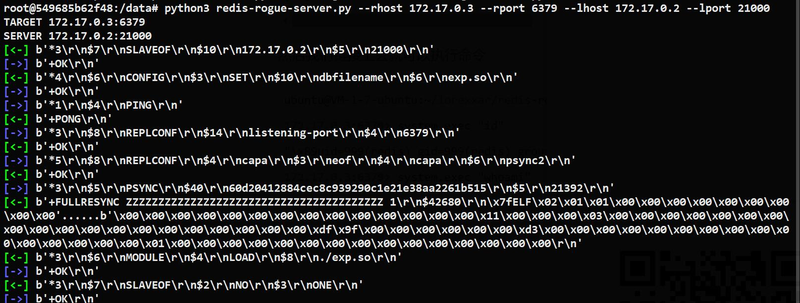

# Redis主从GetShell
## **原理**
### **主备模式**
主备模式可以使各个机器的redis服务联动,指定一个主机负责写入数据,其他备机负责读取数据,可以减轻服务器压力,同时主备之间的数据会保持同步。  

#### **相关命令:**  
Slaveof: [参考](https://redis.io/commands/slaveof)
```
Slaveof host port
```
该命令将该服务器变成host主机上redis服务的备机  
  


#### **数据同步:**  
设置主备模式后,主机可以同步数据到备机上  
**同步过程:**  
[参考文档](https://redis.io/topics/replication)   
主机的数据库含有一个唯一的ID值,这是其数据集合的唯一标志值,并且还有一个偏移量来表示数据的改变情况,当备机连接到主机时,如果备机与主机的数据库ID值不同,则会进行全量更新,备机会丢弃所有数据来接受来自主机的新的数据,如果数据库ID值相同,而偏移量不同则会进行增量更新,主机会发送一些命令来同步备机数据使得偏移量一致  
**全量更新:**  
当备机连接到主机后会发送PSYNC(SYNC)命令告诉主机其数据库ID值和偏移量,比如是第一次连接到主机,因为数据库值ID不一致,进行全量更新,主机开始在后台保存进程来生成RDB文件,同时缓存当时用户的所有输入到缓冲区中,当后台保存完成生成RDB文件后,将RDB文件传输给备机,备机保存在其磁盘上并载入内存,然后主机再将缓冲区的命令通过Redis协议发送给备机,使得主备机数据达到完全一致,在之后主机则只通过发送命令来保持数据一致。  
`主机`

`备机`

**redis协议:**  
[参考文档](https://redis.io/topics/protocol)  
redis有一套自己的通信协议,例如
```
set key test

*3\r\n$3\r\nset\r\n$3\r\nkey\r\n$4\r\ntest
即等于
*3
$3
set
$3
key
$4
test
```
*3表示参数为三个`set`,`key`,`test`,$则是表示后面参数的长度
### **模块扩展**
Redis支持通过加载额外的拓展模块来实现新的功能  
`Module Load module.so`
## **攻击步骤**
1. 使目标执行Slaveof成为我们主机的备机
2. 主机发送FULLRESYNC命令发送payload同步恶意so文件到备机
3. 使备机加载扩展模块
4. 执行命令
### **复现**


之后在备机上即可利用加载的恶意模块  


从备机日志也可以看到整个过程  

